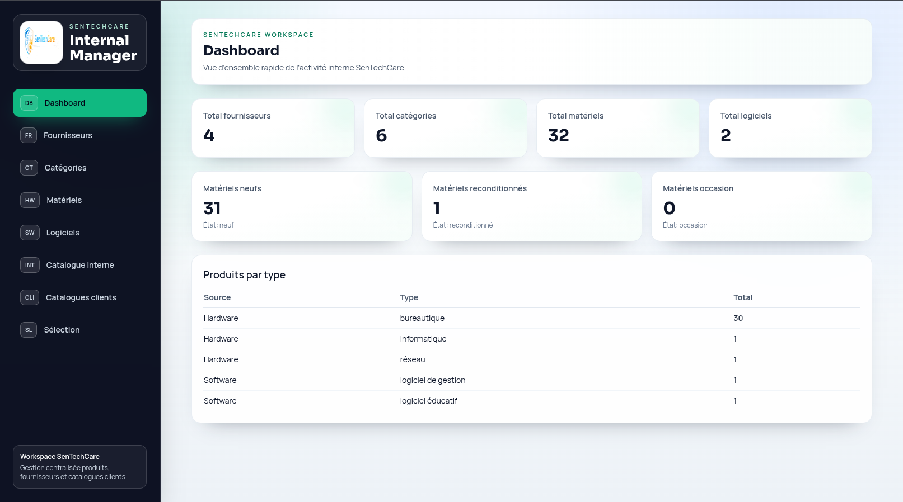
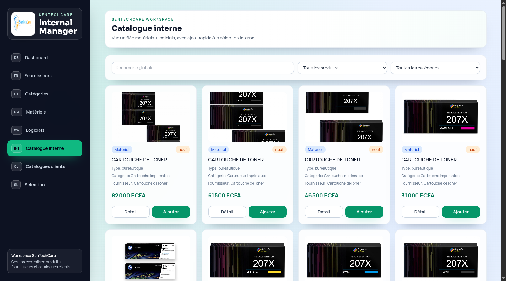
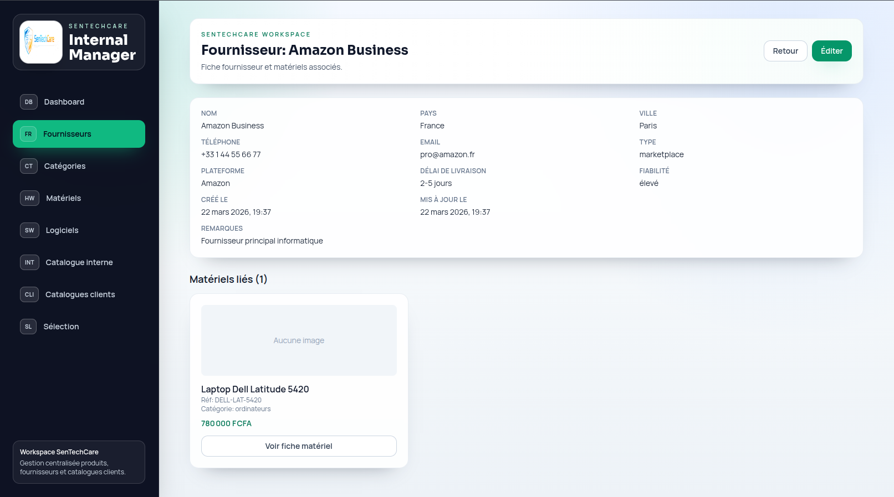
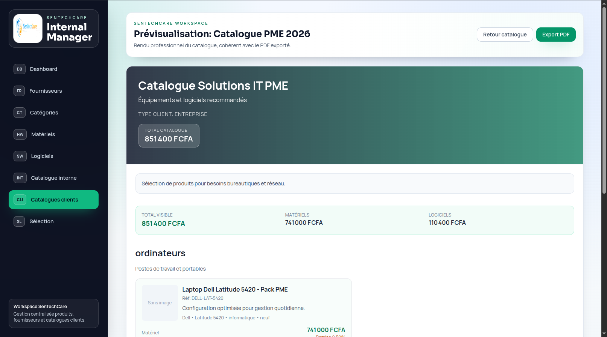

# SenTechCare Internal Manager

SenTechCare Internal Manager est une application full-stack de gestion interne pour structurer un référentiel commercial IT: fournisseurs, catégories, matériels, logiciels, sélection de produits et catalogues clients exportables en PDF.

Le projet met en avant une application métier complète, pensée pour une entreprise de services informatiques qui souhaite centraliser ses produits, préparer des offres commerciales et générer des catalogues propres pour ses clients.



---

## Objectif du projet

L'objectif est de proposer un outil interne permettant de:

- centraliser les fournisseurs IT et leurs informations commerciales;
- gérer un catalogue de matériels et logiciels;
- organiser les produits par catégories;
- suivre les prix d'achat, prix de vente, quantités et états;
- préparer une sélection commerciale;
- générer des catalogues clients prêts à partager;
- exporter les catalogues en PDF.

---

## Aperçu de l'interface

### Dashboard

Le dashboard donne une vision rapide du référentiel interne: nombre de fournisseurs, catégories, matériels, logiciels et répartition des produits par type.


### Catalogue produits

Le catalogue permet de parcourir les matériels et logiciels disponibles, avec leurs informations commerciales et techniques.



### Détail fournisseur ou produit

Les fiches détaillées permettent de consulter les informations utiles avant sélection ou mise à jour: coordonnées, plateforme, fiabilité, délais, prix, stock et notes.



### Catalogue client PDF

Le module catalogues clients permet de préparer un document commercial structuré et exportable en PDF.



---

## Fonctionnalités

### Dashboard

- Statistiques globales du référentiel.
- Nombre total de fournisseurs.
- Nombre total de catégories.
- Nombre total de matériels.
- Nombre total de logiciels.
- Répartition des matériels par état: neuf, reconditionné, occasion.
- Répartition des produits par type.
- Endpoint de santé API/base de données.

### Fournisseurs

- Création, consultation, modification et suppression de fournisseurs.
- Informations de contact: pays, ville, téléphone, email.
- Type de fournisseur: marketplace, local, reconditionné, importateur, etc.
- Plateforme utilisée.
- Délai de livraison.
- Niveau de fiabilité.
- Notes internes.
- Fiche détail fournisseur.

### Catégories

- Création et gestion des catégories.
- Typage des catégories: matériel ou logiciel.
- Description métier.
- Association des produits à une catégorie.
- Organisation du catalogue interne.

### Matériels

- Création, consultation, modification et suppression de matériels.
- Nom, référence, marque, modèle et description.
- Type de matériel: informatique, réseau, sécurité, multimédia, gaming, bureautique ou autre.
- Fournisseur associé.
- Catégorie associée.
- Prix d'achat et prix de vente.
- Quantité disponible.
- État: neuf, reconditionné ou occasion.
- Pays source et délai estimé.
- Image principale, galerie et vidéo.
- Fiche détail produit.

### Logiciels

- Création, consultation, modification et suppression de logiciels.
- Nom, éditeur, version et description.
- Type de licence.
- Prix d'achat et prix de vente.
- Durée de licence ou mode d'abonnement.
- Catégorie et fournisseur associés.
- Notes internes.

### Sélection commerciale

- Ajout de produits à une sélection interne.
- Visualisation des produits retenus.
- Préparation d'une offre ou d'un catalogue client.
- Gestion rapide des produits sélectionnés côté frontend.

### Catalogues clients

- Création de catalogues commerciaux.
- Gestion des types de clients ciblés.
- Ajout de sections dans un catalogue.
- Ajout de matériels ou logiciels dans les sections.
- Personnalisation des éléments du catalogue.
- Duplication d'un catalogue existant.
- Prévisualisation d'un catalogue.
- Export PDF.

### Médias et uploads

- Upload d'images produits.
- Upload de galerie d'images.
- Upload de vidéo produit.
- Stockage local dans `backend/uploads/`.
- Exposition des fichiers médias via Express.

### Scripts locaux

- Scripts Linux/macOS et Windows pour automatiser l'installation.
- Création des fichiers `.env` depuis les exemples.
- Installation des dépendances backend/frontend.
- Chargement du schéma SQL.
- Chargement des données de démonstration.
- Lancement local backend + frontend.

---

## Stack technique

### Frontend

- React 18
- Vite 5
- React Router
- Axios
- Tailwind CSS
- Composants réutilisables
- Hook de sélection commerciale

### Backend

- Node.js
- Express
- MySQL2
- Multer pour les uploads
- PDFKit pour les exports PDF
- Morgan pour les logs HTTP
- Dotenv pour la configuration

### Base de données

- MySQL 8+
- Schéma SQL versionné
- Seed de démonstration
- Migration dédiée au module catalogues clients

---

## Architecture

```text
STC_GEST_1/
  backend/
    sql/
      schema.sql
      seed.sql
      migration_catalogues.sql
    src/
      app.js
      server.js
      config/
      controllers/
      middleware/
      routes/
      utils/
    uploads/
  frontend/
    src/
      components/
      hooks/
      layout/
      pages/
      services/
      utils/
  docs/
  scripts/
  screenshots/
```

---

## API REST

| Domaine | Endpoint |
| --- | --- |
| Santé API | `GET /api/health` |
| Dashboard | `GET /api/dashboard/stats` |
| Fournisseurs | `/api/suppliers` |
| Catégories | `/api/categories` |
| Matériels | `/api/hardware` |
| Logiciels | `/api/software` |
| Types clients | `/api/types-clients` |
| Catalogues | `/api/catalogues` |

Actions catalogues:

- `POST /api/catalogues/:id/duplicate`
- `GET /api/catalogues/:id/preview`
- `GET /api/catalogues/:id/export-pdf`
- `POST /api/catalogues/:id/sections`
- `PUT /api/catalogues/:id/sections/:sectionId`
- `DELETE /api/catalogues/:id/sections/:sectionId`
- `POST /api/catalogues/:id/items`
- `PUT /api/catalogues/:id/items/:itemId`
- `DELETE /api/catalogues/:id/items/:itemId`

---

## Routes frontend

- `/dashboard`
- `/suppliers`
- `/suppliers/new`
- `/suppliers/:id`
- `/suppliers/:id/edit`
- `/categories`
- `/hardware`
- `/hardware/new`
- `/hardware/:id`
- `/hardware/:id/edit`
- `/software`
- `/software/new`
- `/software/:id`
- `/software/:id/edit`
- `/catalog`
- `/catalogues`
- `/catalogues/new`
- `/catalogues/types-clients`
- `/catalogues/:id`
- `/catalogues/:id/edit`
- `/catalogues/:id/products`
- `/catalogues/:id/preview`
- `/selection`

---

## Prérequis

- Node.js 18+
- npm
- MySQL 8+

---

## Configuration

Backend: copier `backend/.env.example` vers `backend/.env`.

```env
PORT=5000
NODE_ENV=development
DB_HOST=localhost
DB_PORT=3306
DB_USER=stc_internal_user
DB_PASSWORD=change_me_locally
DB_NAME=sentechcare_internal_manager
DB_CONNECTION_LIMIT=10
CORS_ORIGIN=http://localhost:5173
MAX_UPLOAD_SIZE=52428800
```

Frontend: copier `frontend/.env.example` vers `frontend/.env`.

```env
VITE_API_BASE_URL=http://localhost:5000/api
```

Ne pas versionner de fichiers `.env` contenant des identifiants réels.

---

## Installation manuelle

Installer les dépendances:

```bash
cd backend
npm install

cd ../frontend
npm install
```

Créer la base et les tables:

```bash
mysql -u root -p < backend/sql/schema.sql
```

Charger les données de démonstration:

```bash
mysql -u root -p < backend/sql/seed.sql
```

Appliquer la migration catalogues si nécessaire:

```bash
mysql -u root -p < backend/sql/migration_catalogues.sql
```

---

## Lancement local

Terminal backend:

```bash
cd backend
npm run dev
```

Backend:

```text
http://localhost:5000
```

Terminal frontend:

```bash
cd frontend
npm run dev
```

Frontend:

```text
http://localhost:5173
```

---

## Scripts utiles

Linux/macOS:

```bash
chmod +x ./scripts/*.sh
./scripts/run-local.sh
./scripts/deploy-local.sh --no-seed
./scripts/deploy-local.sh --build
./scripts/deploy-local.sh --skip-db
./scripts/start-local.sh
```

Windows PowerShell:

```powershell
.\scripts\run-local.ps1
.\scripts\deploy-local.ps1 -NoSeed
.\scripts\deploy-local.ps1 -Build
.\scripts\deploy-local.ps1 -SkipDb
.\scripts\start-local.ps1
```

---

## Import scraping

Le backend contient des scripts permettant d'importer des données produits et de convertir les prix en FCFA.

```bash
cd backend
npm run seed:scrape
```

Options:

```bash
npm run seed:scrape -- --dry-run
npm run seed:scrape -- --limit=8 --dummy-limit=80
```

Le script peut générer un aperçu dans:

```text
backend/sql/seed_scraped_preview.json
```

---

## Données de démonstration

Le seed fournit une base exploitable pour une démonstration locale:

- fournisseurs;
- catégories matériel et logiciel;
- matériels avec prix, stock, état et fournisseur;
- logiciels avec licence et prix;
- types de clients;
- catalogues clients;
- sections et items de catalogues.

Pendant la démonstration locale utilisée pour les captures, l'API retournait notamment:

- 4 fournisseurs;
- 6 catégories;
- 32 matériels;
- 2 logiciels.

---

## Points techniques notables

- API Express découpée par routes et contrôleurs.
- Gestion centralisée des erreurs.
- Pool de connexions MySQL.
- Upload multi-fichiers avec Multer.
- Service statique pour les médias produits.
- Génération de PDF côté backend.
- Frontend React organisé par pages, services et composants.
- Sélection commerciale gérée côté frontend via hook dédié.
- Scripts de démarrage multiplateforme.
- Données de démonstration pour faciliter les tests et captures.

---

## Vérifications recommandées

Backend:

```bash
cd backend
npm run start
```

Frontend:

```bash
cd frontend
npm run build
```

---

## Documentation complémentaire

- [Guide déploiement et utilisation](./docs/LOCAL_DEPLOYMENT_AND_USAGE.md)
- [Installer les outils Windows/Mac](./docs/TOOLS_INSTALL_WINDOWS_MAC.md)

---

## Statut

Projet fonctionnel en environnement local avec backend Express, frontend React/Vite, base MySQL, upload médias, catalogue commercial et export PDF.
