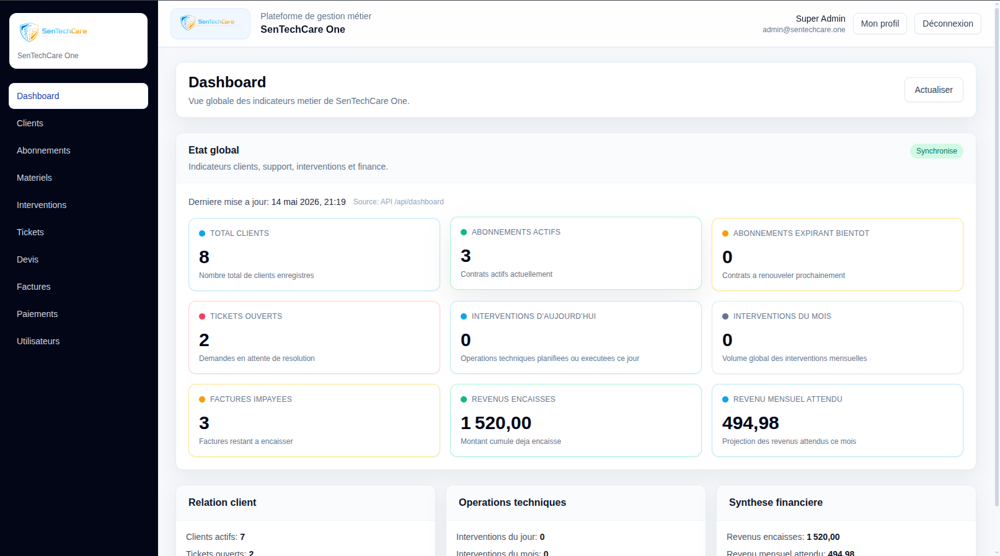
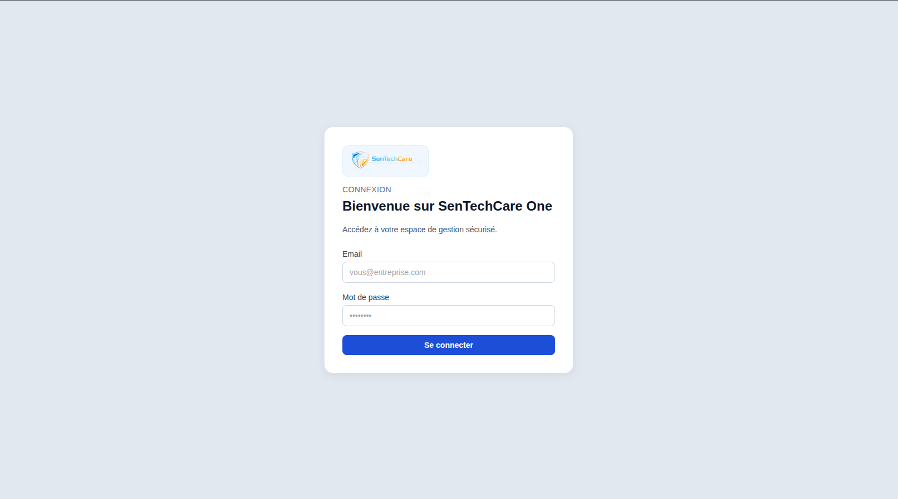
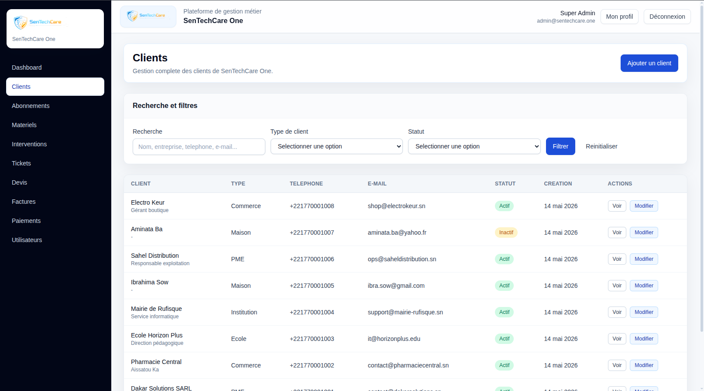
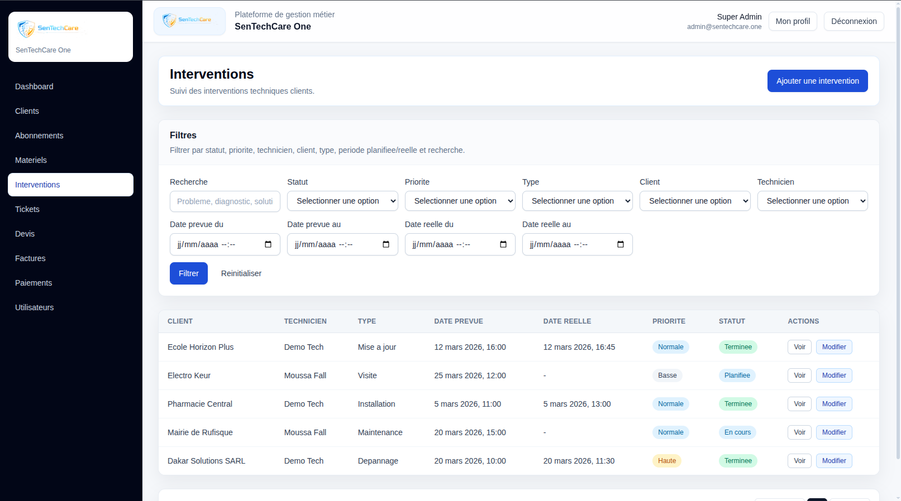
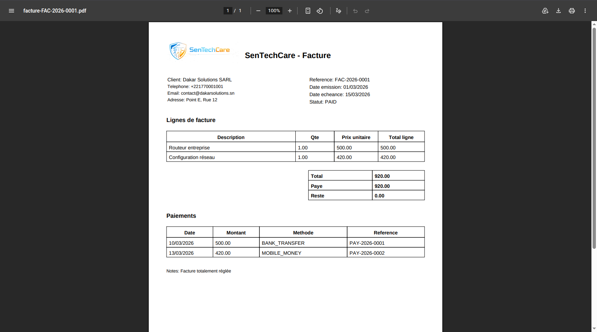

# SenTechCare One

SenTechCare One est une application web de gestion métier destinée aux structures qui assurent du support informatique, de la maintenance, de l'installation de matériel et du suivi client.

Le projet couvre tout le cycle opérationnel: clients, abonnements, équipements installés, tickets support, interventions techniques, devis, factures, paiements et indicateurs KPI.



---

## Objectif du projet

L'objectif est de proposer un outil interne complet pour centraliser les opérations d'une entreprise de services informatiques:

- suivre les clients particuliers, boutiques, écoles, PME et institutions;
- gérer les contrats et abonnements de maintenance;
- historiser les équipements installés chez les clients;
- traiter les demandes support sous forme de tickets;
- planifier et suivre les interventions techniques;
- produire des devis, factures et reçus PDF;
- visualiser les indicateurs clés depuis un dashboard.

---

## Aperçu de l'interface

### Connexion sécurisée

L'application dispose d'un écran d'authentification avec session JWT. Les routes métier sont protégées et l'utilisateur connecté est récupéré côté frontend.



### Dashboard KPI

Le tableau de bord affiche les principaux indicateurs métier:

- nombre total de clients;
- clients actifs;
- abonnements actifs;
- abonnements proches de l'expiration;
- tickets ouverts;
- interventions du jour;
- interventions du mois;
- factures impayées;
- revenus encaissés;
- revenu mensuel attendu.


### Gestion des clients

Le module clients permet de gérer les fiches client avec leur type, coordonnées, ville, pays, contact principal, statut actif et notes internes.



### Tickets et interventions

Le support technique est organisé autour des tickets, des priorités, des statuts et des techniciens assignés. Les tickets peuvent être liés à des interventions pour passer d'une demande support à une action terrain.



### Factures PDF

Le projet intègre la génération de documents PDF pour les devis, factures et reçus de paiement.



---

## Fonctionnalités

### Authentification et sécurité

- Connexion utilisateur par email et mot de passe.
- Génération et validation de token JWT.
- Protection des endpoints backend.
- Récupération du profil connecté avec `/api/auth/me`.
- Gestion des rôles applicatifs: `ADMIN`, `MANAGER`, `TECHNICIAN`, `ACCOUNTANT`, `SUPPORT`.
- Restrictions côté backend avec Spring Security.
- Intercepteur Axios côté frontend pour ajouter automatiquement le token Bearer.
- Déconnexion et nettoyage de session.

### Dashboard

- Agrégation des données métier depuis l'API.
- KPI clients, abonnements, tickets, interventions et revenus.
- Indicateur de synchronisation avec l'API.
- Rafraîchissement manuel des données.
- Vues synthétiques: relation client, opérations techniques, synthèse financière.

### Clients

- Création, modification, consultation et suppression.
- Support de plusieurs types de clients: maison, boutique, école, PME, institution.
- Gestion des informations de contact.
- Recherche et pagination.
- Filtrage par type et statut.
- Consultation détaillée d'un client avec ses éléments associés.

### Abonnements

- Création et suivi des abonnements client.
- Prix mensuel, période de validité et fréquence de facturation.
- Statuts: actif, suspendu, expiré ou annulé.
- Liste des abonnements actifs.
- Liste des abonnements expirés.
- Détection des contrats proches de l'expiration.

### Équipements installés

- Inventaire du matériel déployé chez les clients.
- Catégorie, marque, modèle et numéro de série.
- Date d'installation.
- État de l'équipement.
- Source du matériel.
- Garantie de début et de fin.
- Localisation ou détails d'installation.
- Recherche par numéro de série.
- Consultation des équipements par client.

### Tickets support

- Création et suivi des demandes support.
- Canaux: téléphone, WhatsApp, email, visite.
- Priorités: basse, normale, haute, urgente.
- Statuts: ouvert, en cours, résolu, fermé.
- Assignation d'un technicien.
- Filtres par client, statut, priorité, canal et technicien.
- Conversion d'un ticket en intervention.

### Interventions techniques

- Planification d'interventions terrain ou à distance.
- Types: installation, dépannage, maintenance, mise à jour, visite, autre.
- Statuts: en attente, planifiée, en cours, terminée, annulée.
- Date prévue et date réelle.
- Durée d'intervention.
- Coût associé.
- Assignation à un technicien.
- Filtrage par statut, priorité, type, client et technicien.

### Devis

- Création de devis avec lignes détaillées.
- Référence unique.
- Statut du devis.
- Sous-total, remise et total.
- Consultation et modification.
- Recherche par référence.
- Génération PDF.
- Conversion d'un devis en facture.

### Factures

- Création de factures avec lignes détaillées.
- Référence unique.
- Date d'émission et date d'échéance.
- Statuts: brouillon, émise, payée, partiellement payée, impayée, annulée.
- Montant total, montant payé et reste à payer.
- Recherche par référence.
- Génération PDF.

### Paiements

- Enregistrement des paiements liés aux factures.
- Montant, date, méthode et référence de paiement.
- Consultation des paiements par facture.
- Mise à jour automatique du montant payé et du reste à payer.
- Génération de reçu PDF.

### Utilisateurs et rôles

- Création et gestion des utilisateurs.
- Activation ou désactivation d'un compte.
- Association à un rôle.
- Liste des techniciens disponibles.
- Gestion du profil connecté.
- Accès restreint selon les rôles.

---

## Stack technique

### Backend

- Java 21
- Spring Boot 4
- Spring Web
- Spring Data JPA
- Hibernate
- Spring Security
- JWT
- MySQL 8+
- MapStruct
- Lombok
- OpenPDF
- Maven Wrapper

### Frontend

- React 19
- Vite 5
- Tailwind CSS 3
- React Router
- Axios
- React Hook Form
- Zod

---

## Architecture du projet

```text
SenTechCare-One/
  bdd/
    base.sql
    insert.sql
    seed_local_demo.sql
  src/main/java/com/sentechcare/one/
    auth/
    client/
    dashboard/
    equipment/
    intervention/
    invoice/
    payment/
    quote/
    role/
    security/
    subscription/
    ticket/
    user/
  src/main/resources/
    application.yml
  sentechcare-one-web/
    src/
      api/
      app/
      components/
      features/
      layouts/
      pages/
      router/
      styles/
```

---

## Base de données

Le dossier `bdd/` contient les scripts nécessaires:

- `base.sql`: création du schéma, tables, index, contraintes, vues et logique SQL;
- `insert.sql`: données minimales nécessaires au démarrage;
- `seed_local_demo.sql`: jeu de données de démonstration pour les captures et tests locaux.

Principales tables:

- `roles`
- `users`
- `clients`
- `subscriptions`
- `installed_equipments`
- `tickets`
- `interventions`
- `quotes`
- `quote_items`
- `invoices`
- `invoice_items`
- `payments`

---

## API principale

| Domaine | Endpoint |
| --- | --- |
| Authentification | `/api/auth` |
| Dashboard | `/api/dashboard` |
| Clients | `/api/clients` |
| Abonnements | `/api/subscriptions` |
| Équipements | `/api/equipments` |
| Tickets | `/api/tickets` |
| Interventions | `/api/interventions` |
| Devis | `/api/quotes` |
| Factures | `/api/invoices` |
| Paiements | `/api/payments` |
| Utilisateurs | `/api/users` |
| Rôles | `/api/roles` |

Endpoints PDF:

- `GET /api/quotes/{id}/pdf`
- `GET /api/invoices/{id}/pdf`
- `GET /api/payments/{id}/receipt/pdf`

---

## Prérequis

- JDK 21
- Node.js 20+
- npm 10+
- MySQL 8+

---

## Configuration backend

Le backend lit les variables suivantes:

```env
DB_URL=jdbc:mysql://localhost:3306/sentechcare_one?createDatabaseIfNotExist=true&useSSL=false&allowPublicKeyRetrieval=true&serverTimezone=UTC
DB_USERNAME=sentechcare_user
DB_PASSWORD=change_me_locally
SERVER_PORT=8080
JWT_SECRET=change_me_with_a_long_local_secret
JWT_EXPIRATION_MS=86400000
CORS_ALLOWED_ORIGINS=http://localhost:5173
```

Ne pas versionner de `.env` contenant des secrets réels.

---

## Initialisation locale

Créer et charger la base:

```bash
mysql -u root -p < bdd/base.sql
mysql -u root -p < bdd/insert.sql
```

Ajouter des données de démonstration:

```bash
mysql -u root -p sentechcare_one < bdd/seed_local_demo.sql
```

Le projet utilise `spring.jpa.hibernate.ddl-auto=validate`: le schéma SQL doit donc exister avant le démarrage du backend.

---

## Lancement backend

Depuis la racine du projet:

```bash
./mvnw spring-boot:run
```

API disponible sur:

```text
http://localhost:8080
```

Commandes utiles:

```bash
./mvnw test
./mvnw -DskipTests package
```

---

## Lancement frontend

Depuis `sentechcare-one-web/`:

```bash
cp .env.example .env
npm install
npm run dev
```

Interface disponible sur:

```text
http://localhost:5173
```

Build production:

```bash
npm run build
npm run preview
```

Variables frontend:

```env
VITE_API_BASE_URL=/api
VITE_BACKEND_PROXY_TARGET=http://localhost:8080
VITE_APP_NAME=SenTechCare One
VITE_ENABLE_QUOTE_CONVERSION=true
```

---

## Données de démonstration

Le seed de démonstration fournit un environnement réaliste pour tester l'application:

- 5 utilisateurs;
- 8 clients;
- 6 abonnements;
- 7 équipements installés;
- 5 interventions;
- 4 tickets;
- 4 devis;
- 5 factures;
- 3 paiements.

Les identifiants de démonstration sont réservés à un usage local et doivent être remplacés avant tout déploiement public.

---

## Points techniques notables

- Architecture backend découpée par domaine métier.
- DTOs et mappers pour séparer API et entités JPA.
- Validation côté backend et côté frontend.
- Gestion centralisée des erreurs API.
- Pagination et filtres sur les listes métier.
- Génération de documents PDF côté backend.
- Proxy Vite pour simplifier le développement local.
- Interface responsive basée sur des composants réutilisables.
- Vues SQL dédiées aux indicateurs dashboard.

---

## Vérifications recommandées

Backend:

```bash
./mvnw test
```

Frontend:

```bash
npm run build
```

---

## Statut

Projet fonctionnel en environnement local avec frontend React, backend Spring Boot, base MySQL et données de démonstration.
