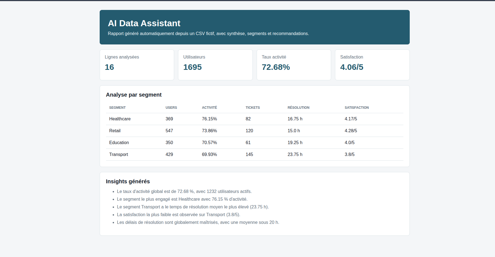
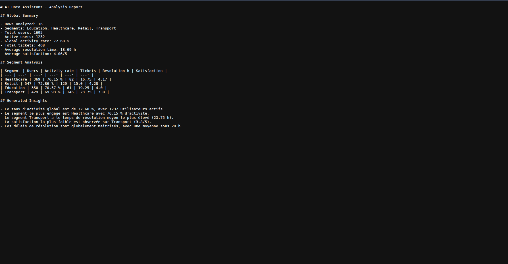
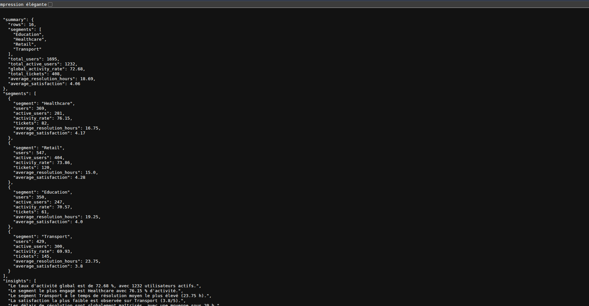
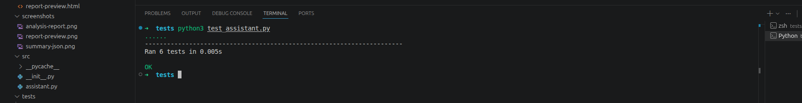

# AI Data Assistant

Projet vitrine IA/data : assistant Python qui analyse un CSV fictif, calcule des statistiques, détecte des tendances simples et génère des insights lisibles.

## Objectif

Montrer une approche IA pragmatique sans exposer de données privées :

- charger un fichier CSV ;
- résumer les colonnes ;
- calculer des indicateurs ;
- détecter des segments intéressants ;
- générer des recommandations textuelles ;
- produire un rapport Markdown, un export JSON et une prévisualisation HTML.

Le projet utilise uniquement la bibliothèque standard Python pour rester facile à exécuter.

## Stack

- Python 3
- CSV
- Markdown
- JSON
- HTML
- Analyse statistique simple

## Lancement

```bash
python3 src/assistant.py data/sample_activity.csv
```

Le rapport est généré dans :

```text
outputs/analysis-report.md
outputs/analysis-summary.json
outputs/report-preview.html
```

## Tests

```bash
python3 -m unittest discover -s tests
```

## Fonctionnalités

- lecture de données tabulaires ;
- conversion numérique ;
- moyenne, minimum, maximum ;
- taux d'activité ;
- top segments ;
- détection d'anomalies simples ;
- recommandations générées automatiquement.
- rapport HTML prêt pour capture portfolio.

## Résultat de validation

```text
6 tests OK
```

## Captures









## Captures réalisées

- `screenshots/report-preview.png` : prévisualisation `outputs/report-preview.html`
- `screenshots/analysis-report.png` : rapport Markdown généré
- `screenshots/summary-json.png` : export `outputs/analysis-summary.json`
- `screenshots/tests.png` : résultat des tests unitaires

## Améliorations prévues

- ajouter pandas ;
- ajouter scikit-learn ;
- ajouter clustering ;
- ajouter interface Streamlit ;
- ajouter intégration LLM optionnelle.
