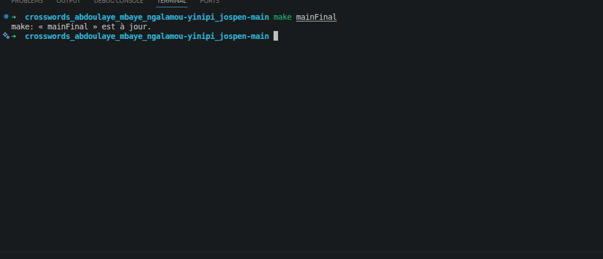
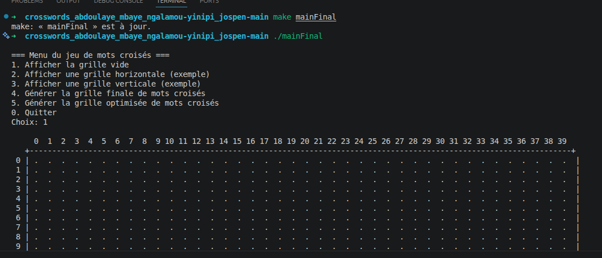
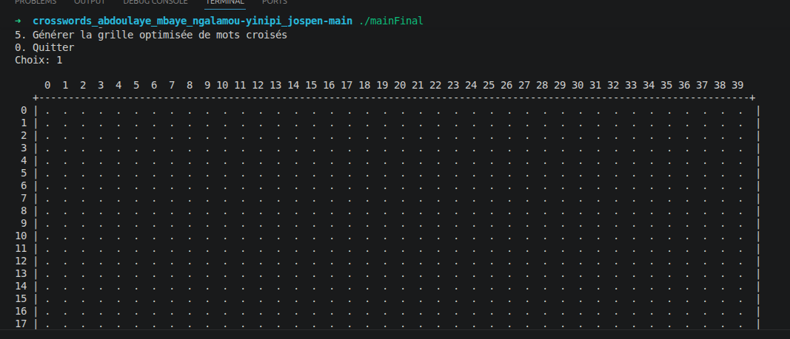
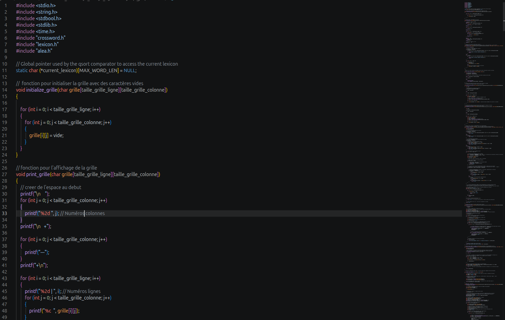

# Projet Crossword en C

Projet vitrine algorithmique : générateur de mots croisés en langage C avec lecture de lexique, placement horizontal/vertical, validation de contraintes et mode jeu.

## Objectif

Développer un programme C capable de construire une grille de mots croisés à partir d'un lexique :

- lire un fichier de mots ;
- initialiser une grille ;
- placer des mots horizontalement ou verticalement ;
- vérifier les intersections et les conflits ;
- proposer une génération optimisée ;
- fournir un mode jouable en console.

## Stack

- C
- Makefile
- Fichiers texte comme lexiques
- Programmation structurée

## Fonctionnalités

- Menu console interactif.
- Grille vide.
- Génération horizontale simple.
- Génération verticale simple.
- Génération valide avec contraintes.
- Génération optimisée : priorité aux mots longs et maximisation des intersections.
- Mode jeu séparé avec grille masquée.

## Compilation

```bash
make mainFinal
```

Lancer le menu principal :

```bash
./mainFinal
```

Lancer le mode jouable :

```bash
make run_jouable
```

## Démonstration rapide

Exécuter automatiquement la génération optimisée puis quitter :

```bash
printf '5\n0\n' | ./mainFinal
```

Note : lorsque la grille devient dense, certains mots ne peuvent pas être placés. Le programme affiche alors des avertissements, ce qui illustre les limites et contraintes de placement.

## Structure

```text
main.c          # menu et orchestration
crossword.c     # génération et placement des mots
crossword.h
lexicon.c       # lecture du lexique
lexicon.h
alea.c          # utilitaires aléatoires
cross_jouable.c # mode jeu
makefile
```

## Complexité

- Lecture du lexique : `Θ(N * W)` avec `N` mots et longueur moyenne `W`.
- Génération simple : `Θ(N * W)`.
- Génération valide : dépend du nombre de positions testées dans une grille fixe.
- Génération optimisée : ajout d'un tri des mots, environ `Θ(N log N)` pour l'ordre de placement.
- Mémoire : grille fixe `40 x 40` et tableau de mots, donc principalement `Θ(N)`.

## Captures









## Captures réalisées

- `screenshots/build.png` : compilation `make mainFinal`
- `screenshots/menu.png` : menu console
- `screenshots/grid.png` : grille générée
- `screenshots/source.png` : aperçu de `crossword.c`

## Ce que ce projet démontre

- programmation structurée en C ;
- manipulation de tableaux et chaînes ;
- lecture de fichiers ;
- algorithmique de placement sous contraintes ;
- Makefile et exécution console.
