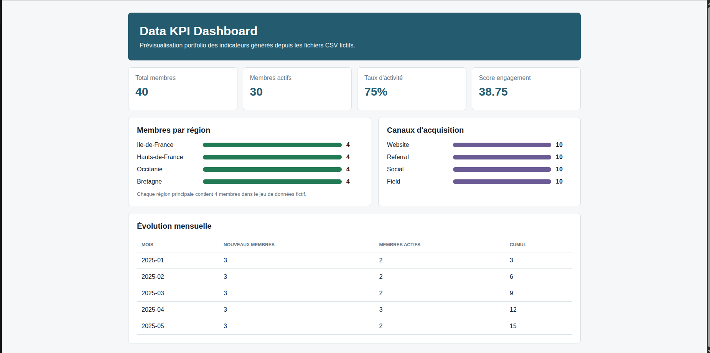
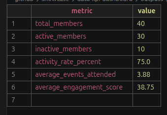

# Data KPI Dashboard

Projet vitrine orienté data/BI : nettoyage de données fictives, calcul d'indicateurs KPI et préparation d'un tableau de bord Power BI.

## Objectif

Montrer une démarche complète et reproductible :

- partir d'un fichier CSV brut ;
- nettoyer et enrichir les données ;
- calculer des KPI ;
- produire des fichiers prêts pour Power BI ;
- documenter les choix d'analyse.

Les données sont entièrement fictives et ne représentent aucune organisation réelle.

## Stack

- Python
- SQL / logique relationnelle
- Power BI
- CSV

## Indicateurs suivis

- nombre total de membres ;
- membres actifs ;
- répartition par région ;
- évolution mensuelle des inscriptions ;
- taux d'activité ;
- répartition par canal d'acquisition ;
- score d'engagement moyen.

## Structure

```text
data/
  sample_members.csv
src/
  build_kpis.py
docs/
  dashboard-spec.md
powerbi/
  README.md
screenshots/
```

## Installation

Le script fonctionne avec Python 3 uniquement, sans dépendance externe.

## Générer les fichiers KPI

```bash
python src/build_kpis.py
```

Le script crée un dossier `outputs/` avec :

- `clean_members.csv`
- `kpi_summary.csv`
- `members_by_region.csv`
- `members_by_month.csv`
- `members_by_channel.csv`
- `dashboard-preview.html`

## Prévisualisation HTML

Une prévisualisation statique est disponible pour les captures rapides sans ouvrir Power BI :

```text
outputs/dashboard-preview.html
```

## Utilisation Power BI

1. Importer les CSV générés dans `outputs/`.
2. Relier les tables si nécessaire.
3. Créer les cartes KPI et graphiques décrits dans `docs/dashboard-spec.md`.
4. Exporter une capture dans `screenshots/`.

## Captures





## Captures réalisées

- `screenshots/dashboard-preview.png` : prévisualisation HTML
- `screenshots/kpi-summary.png` : fichier `outputs/kpi_summary.csv`

## Ce que ce projet démontre

- préparation de données ;
- calcul d'indicateurs ;
- structuration d'un mini-projet data ;
- documentation orientée usage ;
- capacité à construire un dashboard décisionnel.

## Améliorations prévues

- ajouter une version pandas en complément ;
- ajouter un script SQL équivalent ;
- ajouter des tests de validation des données ;
- ajouter une capture Power BI complète ;
- ajouter un export PDF du dashboard.
