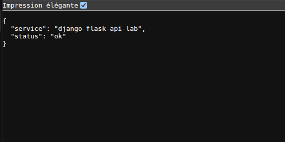
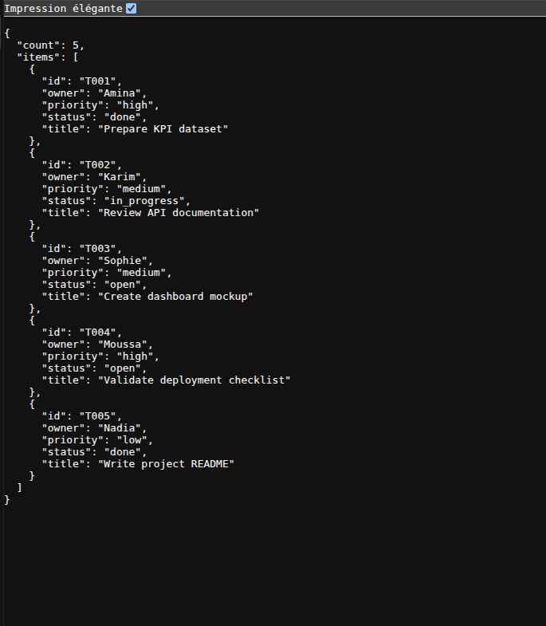
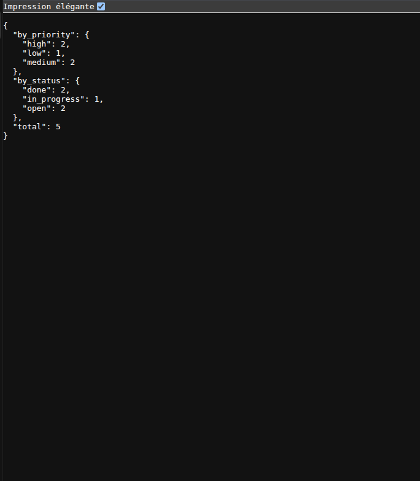
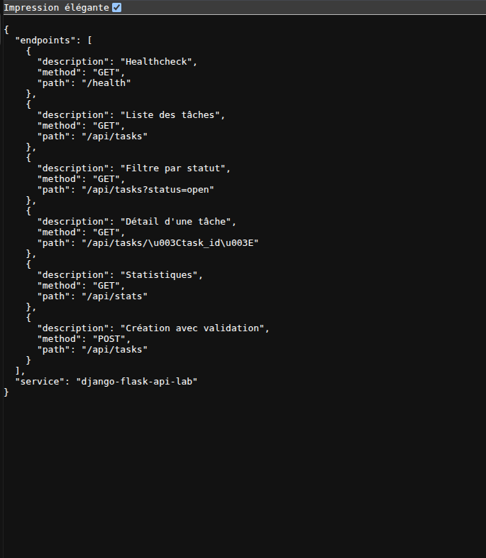
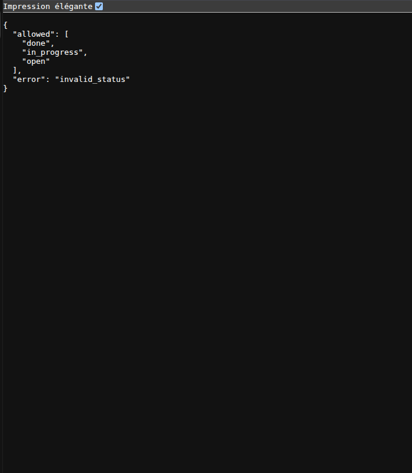

# Django Flask API Lab

Projet vitrine backend Python : API REST Flask avec données fictives, endpoints documentés, validation simple et tests.

## Objectif

Montrer les bases d'une API backend propre :

- routes REST ;
- séparation app / service / données ;
- validation de paramètres ;
- réponses JSON ;
- tests automatisés ;
- documentation d'utilisation.

Le projet est volontairement simple pour rester lisible et facilement testable par un recruteur.

## Stack

- Python
- Flask
- PyTest
- JSON

## Endpoints

```text
GET /health
GET /api/tasks
GET /api/tasks?status=open
GET /api/tasks/<task_id>
GET /api/stats
GET /api/docs
POST /api/tasks
```

## Installation

```bash
python3 -m venv .venv
source .venv/bin/activate
pip install -r requirements.txt
```

## Lancement

```bash
flask --app app.main run --debug
```

Puis ouvrir :

```text
http://127.0.0.1:5000/health
```

Pour les captures portfolio, l'API peut être lancée sur un port dédié :

```bash
.venv/bin/flask --app app.main run --host 127.0.0.1 --port 6070
```

URL locale utilisée pour la démo :

```text
http://127.0.0.1:6070
```

## Tests

```bash
.venv/bin/pytest
```

Résultat de validation local : `8 passed`.

## Exemples

Créer une tâche fictive :

```bash
curl -X POST http://127.0.0.1:6070/api/tasks \
  -H "Content-Type: application/json" \
  -d '{"title":"Prepare dashboard export","owner":"Amina","status":"open","priority":"high"}'
```

## Captures











## Captures réalisées

- `screenshots/health.png` : réponse de `/health`
- `screenshots/tasks.png` : liste `/api/tasks`
- `screenshots/stats.png` : statistiques `/api/stats`
- `screenshots/docs.png` : documentation `/api/docs`
- `screenshots/validation.png` : réponse d'erreur sur un statut invalide

## Améliorations prévues

- ajouter persistance SQLite ;
- proposer une variante Django REST Framework ;
- ajouter authentification JWT ;
- ajouter documentation OpenAPI ;
- ajouter Dockerfile.
