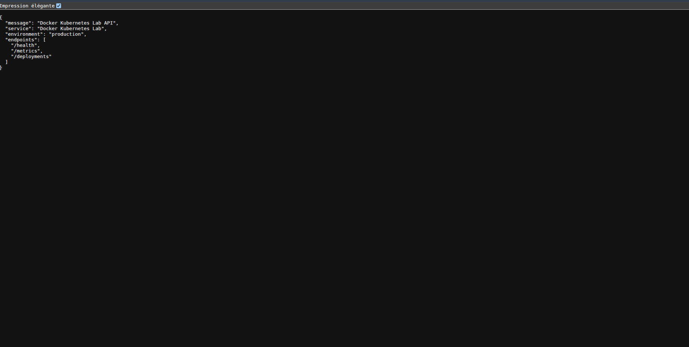
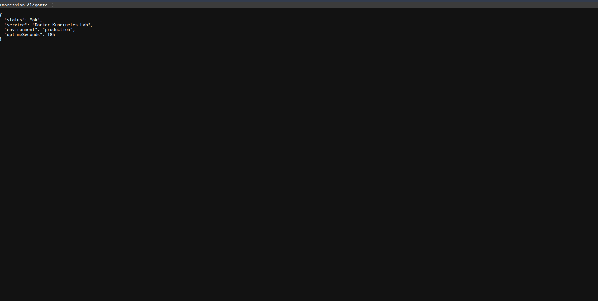
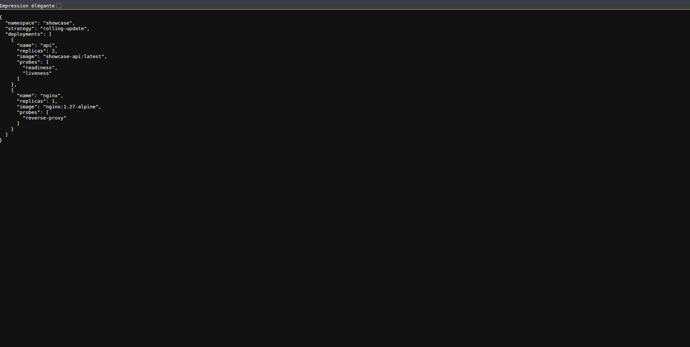
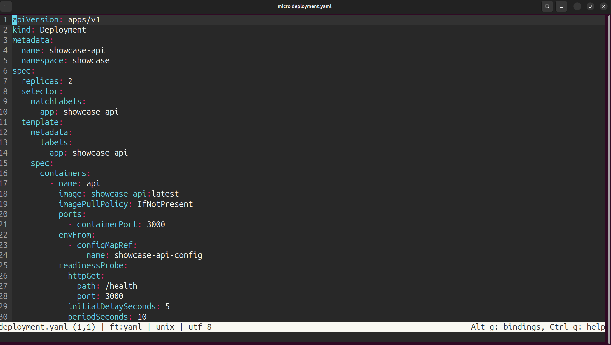

# Docker Kubernetes Lab

Projet vitrine DevOps : conteneurisation d'une petite API, reverse proxy Nginx, Docker Compose et manifests Kubernetes.

## Objectif

Montrer les bases d'un déploiement applicatif :

- créer une API simple ;
- écrire un Dockerfile propre ;
- lancer l'application avec Docker Compose ;
- ajouter Nginx comme reverse proxy ;
- préparer des manifests Kubernetes ;
- documenter les commandes utiles.

## Stack

- Node.js
- Docker
- Docker Compose
- Nginx
- Kubernetes

## Structure

```text
app/
  src/server.js
  package.json
  Dockerfile
nginx/
  default.conf
k8s/
  namespace.yaml
  configmap.yaml
  deployment.yaml
  service.yaml
  ingress.yaml
docker-compose.yml
```

## Lancement avec Docker Compose

```bash
docker compose up --build
```

Endpoints :

```text
http://localhost:8080
http://localhost:8080/health
http://localhost:8080/metrics
http://localhost:8080/deployments
```

## Lancement local sans Docker

Pour vérifier rapidement l'API avant les captures :

```bash
cd app
PORT=3070 APP_NAME="Docker Kubernetes Lab" NODE_ENV=production node src/server.js
```

Endpoints locaux :

```text
http://127.0.0.1:3070
http://127.0.0.1:3070/health
http://127.0.0.1:3070/metrics
http://127.0.0.1:3070/deployments
```

## Déploiement Kubernetes local

Avec un cluster local type Minikube, Kind ou Docker Desktop :

```bash
kubectl apply -f k8s/namespace.yaml
kubectl apply -f k8s/configmap.yaml
kubectl apply -f k8s/deployment.yaml
kubectl apply -f k8s/service.yaml
kubectl apply -f k8s/ingress.yaml
```

Vérifier :

```bash
kubectl get all -n showcase
kubectl logs -n showcase deployment/showcase-api
```

## Ce que ce projet démontre

- Dockerfile multi-étapes simple ;
- séparation application / proxy ;
- variables de configuration ;
- probes Kubernetes ;
- service interne ;
- endpoint de déploiement simulant une lecture DevOps ;
- documentation de déploiement.

## Captures









## Captures réalisées

- `screenshots/api-root.png` : réponse JSON de `/`
- `screenshots/health.png` : statut `/health`
- `screenshots/deployments.png` : stratégie et replicas `/deployments`
- `screenshots/k8s-manifests.png` : aperçu des manifests Kubernetes dans l'éditeur

## Améliorations prévues

- ajouter GitHub Actions ;
- ajouter tests de santé automatisés ;
- ajouter Helm chart ;
- ajouter observabilité Prometheus/Grafana ;
- ajouter déploiement blue/green simplifié.
