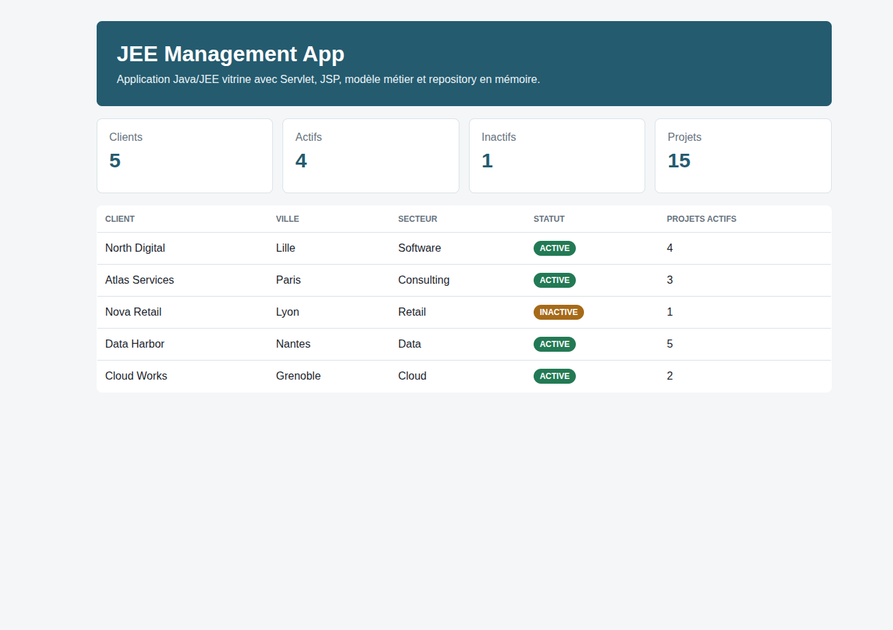
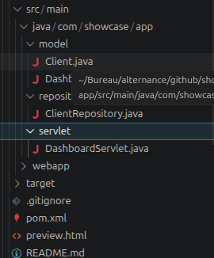

# JEE Management App

Projet vitrine Java/JEE : application de gestion MVC avec Servlet, JSP, modèle métier et repository en mémoire.

## Objectif

Montrer les bases d'une application Java entreprise :

- architecture MVC ;
- Servlet contrôleur ;
- JSP côté vue ;
- modèle métier ;
- repository ;
- Maven ;
- données fictives ;
- structure lisible.

## Stack

- Java 17+
- Jakarta Servlet
- JSP / JSTL
- Maven
- Tomcat 10+

## Fonctionnalités

- Page d'accueil
- Liste de clients fictifs
- Indicateurs simples
- Séparation modèle / repository / servlet
- Vue JSP

## Installation

```bash
mvn clean package
```

Déployer ensuite le fichier WAR généré :

```text
target/jee-management-app.war
```

sur Tomcat 10+.

## Prévisualisation locale

Une page statique permet de capturer le rendu portfolio sans lancer Tomcat :

```text
preview.html
```

La logique Java du modèle et du repository peut être vérifiée avec :

```bash
javac -d /tmp/jee-management-check src/main/java/com/showcase/app/model/*.java src/main/java/com/showcase/app/repository/*.java
```

## Structure

```text
src/main/java/com/showcase/app/
  model/
  repository/
  servlet/
src/main/webapp/WEB-INF/views/
```

## Données

Les données sont fictives et stockées en mémoire pour garder le projet simple et publiable.

## Captures





## Captures réalisées

- `screenshots/preview.png` : rendu de `preview.html`
- `screenshots/java-structure.png` : structure `src/main/java`

## Améliorations prévues

- ajouter JPA/Hibernate ;
- ajouter MySQL ;
- ajouter formulaires CRUD ;
- ajouter validation ;
- ajouter tests ;
- ajouter Dockerfile Tomcat.
