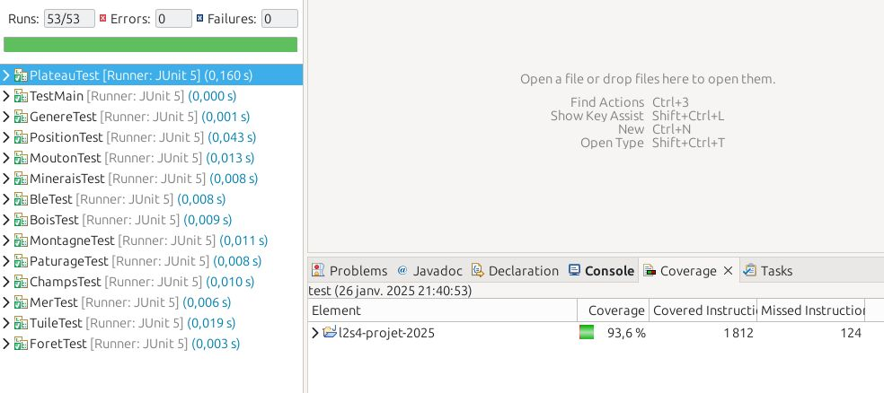
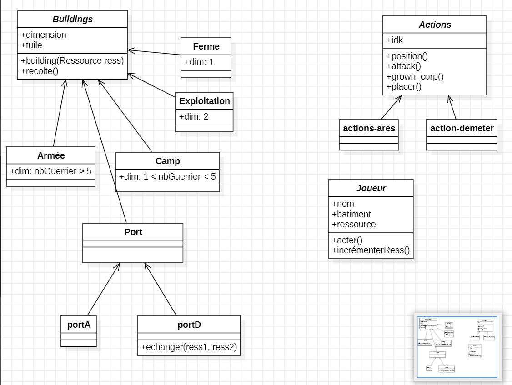
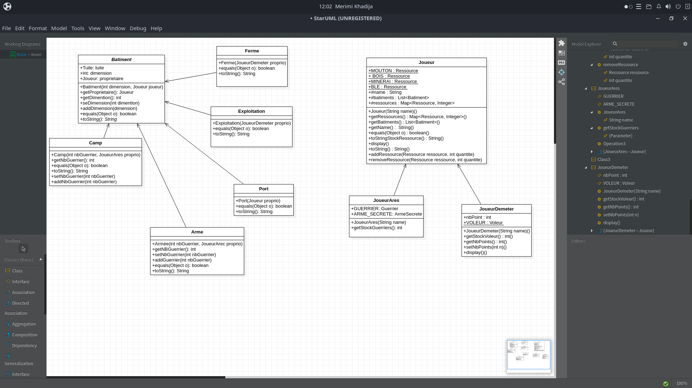
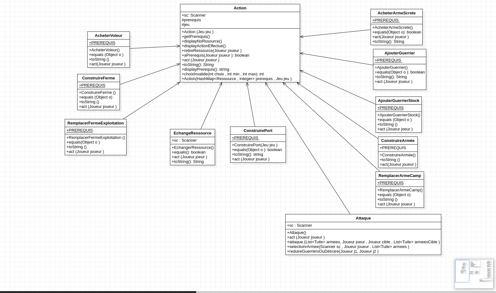
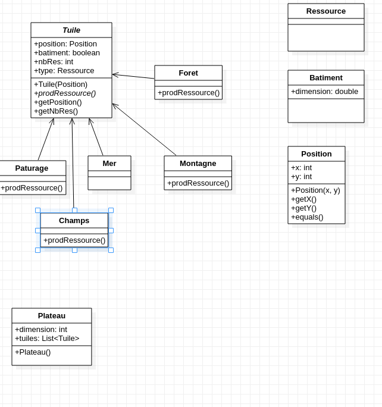

# Ares & Demeter Strategy Game

Projet Java de strategie au tour par tour realise en equipe dans le cadre du projet L2S4 2025. C'est un des projets Java les plus importants de ce showcase : il combine moteur de jeu, modelisation objet, plateau, ressources, actions, tests et deux variantes de regles.

## Ce que le projet demontre

- Architecture objet avec un moteur commun reutilisable.
- Deux jeux construits sur le meme socle : `Ares` et `Demeter`.
- Plateau configurable avec tuiles, positions, iles et ressources.
- Actions polymorphes : construire, echanger, remplacer, attaquer, jouer un voleur, construire un port.
- Joueurs specialises, batiments specialises et conditions de victoire propres a chaque variante.
- Suite de tests JUnit couvrant le moteur, les actions, les ressources, les tuiles, les batiments et les variantes.
- Documentation de livrables avec UML, couverture de tests et etat d'avancement.

## Chiffres rapides

- 112 fichiers Java source/test.
- 2 variantes de jeu : `Ares` et `Demeter`.
- 4 livrables successifs documentes.
- Images UML et couverture de tests conservees dans `image/`.

## Compilation

```bash
mkdir -p classes
javac -encoding UTF-8 -d classes $(find src -name "*.java")
```

Le projet utilise des noms de classes avec accents, donc l'encodage UTF-8 est important.

## Execution

```bash
java -cp classes AresMain
java -cp classes DemeterMain
```

## Tests

Les tests JUnit sont dans `test/`. Le fichier `junit-console.jar` original n'est pas versionne dans ce showcase afin d'eviter de publier des binaires. Pour relancer les tests, ajouter localement JUnit Console puis executer :

```bash
javac -encoding UTF-8 -d classes -classpath junit-console.jar:classes $(find src test -name "*.java")
java -jar junit-console.jar -classpath classes -scan-classpath
```

## Note publication

Les fichiers generes et binaires (`classes/`, `.class`, `.jar`) ainsi que le dossier `.git` d'origine ne sont pas inclus. Le README historique du livrable est conserve ci-dessous car il documente l'evolution du projet.

---

# README historique du livrable

# l2s4-projet-2025

Vous devez *forker* ce projet dans votre espace de travail Gitlab (bouton `Fork`) et vidéo sur le [portail](https://www.fil.univ-lille.fr/portail/index.php?dipl=L&sem=S4&ue=Projet&label=Documents)
Un unique fork doit être réalisé par équipe.

Une fois cela réalisé, supprimer ces premières lignes et remplissez les noms des membres de votre équipe.
N'oubliez pas d'ajouter les autres membres de votre équipe aux membres du projet, ainsi que votre enseignant·e (statut Maintainer).

# Equipe

- Lina BEN SMIDA
- Eya ZEIDI
- Khadija MERIMI
- Abdoulaye MBAYE 

# Sujet

[Le sujet 2025](https://www.fil.univ-lille.fr/~varre/portail/l2s4-projet/sujet2025.pdf)

# Livrables

Les paragraphes concernant les livrables doivent être rempli avant la date de rendu du livrable. A chaque fois on décrira l'état du projet par rapport aux objectifs du livrable. Il est attendu un texte de plusieurs lignes qui explique la modélisation choisie, et/ou les algorithmes choisis et/ou les modifications apportées à la modélisation du livrable précédent.

Un lien vers une image de l'UML doit être fourni (une photo d'un diagramme UML fait à la main est suffisant).

## Livrable 1
Le Livrable1 est achevé.
### Atteinte des objectifs
Le premier livrable a été conçu avec succès selon l’architecture suivante :  

### **1. Gestion des ressources**  
Une interface `Ressource` a été créée, dont héritent toutes les ressources disponibles :  
- `Mouton`  
- `Bois`  
- `Blé`  
- `Minerais`  

### **2. Structure des tuiles**  
Une classe abstraite `Tuile` a été définie, dont héritent les différents types de tuiles :  
- `Champs` → Ressource : `Blé`  
- `Forêt` → Ressource : `Bois`  
- `Mer` → Aucune ressource  
- `Montagne` → Ressource : `Minerais`  
- `Pâturage` → Ressource : `Mouton`  

### **3. Autres classes essentielles**  
- `Position` : Gère la position associée à chaque tuile.  
- `Genere` : Responsable de la génération des éléments à placer sur le plateau.  

### Difficultés restant à résoudre
L’un des principaux défis rencontrés concerne la génération aléatoire des tuiles sur le plateau. Actuellement, lorsqu’un nouveau type de tuile est ajouté (par exemple, une tuile `Volcan`), il est nécessaire de modifier manuellement :  
1. **La liste des types de tuiles** définie dans `Genere.java`.  
2. **La méthode `genereTuile`**, qui doit prendre en compte cette nouvelle tuile.  

Une solution basée sur la **réflexion Java** pour identifier automatiquement toutes les sous-classes de `Tuile` a été envisagée, mais cette approche s’est révélée trop complexe à gérer. Une alternative plus flexible devra être étudiée pour faciliter l'ajout dynamique de nouvelles tuiles 

## Commande Pour le Livrable 1
### Pour Generer la docs
```javadoc -d docs -sourcepath src -subpackages util.plateau```
### Pour compiler tout le code de plateau:
```javac -sourcepath src src/util/plateau/*.java -d classes```
### Pour executer le fichier PlateauMain:
```java -classpath classes util.plateau.PlateauMain <number ligne> <number colonne>```
### Pour compiler les fichier teste du plateau:
```javac -classpath junit-console.jar:classes test/util/plateau/*.java test/util/plateau/outils/genere/*.java test/util/plateau/outils/position/*.java test/util/plateau/outils/ressource/*.java test/util/plateau/outils/tuile/*.java -d classes```
### Pour executer les fichier testes du plateau et de tous les outils necessaire:
```java -jar junit-console.jar -classpath test:classes -scan-classpath```
### Pour generer le jar du Projet:
```jar cvfe Livrable1.jar util.plateau.PlateauMain -C classes .```
### Pour executer le jar du projet:
```java -jar Livrable1.jar <nb ligne> <nb colonne>```
### Couverture des teste sur eclipse :

### UML: 



# Livrable 2 - Rapport Final

## **1. Achèvement du Livrable 2**
Le **Livrable 2** a été conçu avec succès selon l’architecture suivante :

---

## **1. Jeu**
Une classe abstraite `Jeu` a été créée. Tous les jeux héritent de cette classe, notamment :
- `Demeter`
- `Ares`

Ces classes héritent des actions partagées par `Jeu`.
telle que :
**Action**
- `ConstruirePort`

### **1.1 Structure des Jeux**
### **🔹 Ares**  
Le jeu `Ares` hérite des ressources de `Joueur` et des actions partagées par la classe `Jeu`.  
Il y ajoute :
- **Deux actions spécifiques** : `ConstruireArmée` et `RemplacerArmeCamp`
- **Deux nouvelles ressources** : `Guerrier` et `ArmeSecrete`

#### **Ressources**
- `Guerrier`
- `ArmeSecrete`

#### **Bâtiments**
- `Armée`
- `Camp`

#### **Actions**
- `ConstruireArmée` → Prérequis : `{Bois: 1, Mouton: 1, Blé: 1}`
- `RemplacerArmeCamp` → Prérequis : `{Bois: 2, Minerais: 3}`

---

### **🔹 Demeter**
Le jeu `Demeter` hérite également des ressources de `Joueur` et actions partagées par la classe `Jeu`.  
Il y ajoute :
- **Deux actions spécifiques** : `ConstruireFerme` et `RemplacerFermeExploitation`
- **Une nouvelle ressource** : `Voleur`

#### **Ressources**
- `Voleur`

#### **Bâtiments**
- `Ferme`
- `Exploitation`

#### **Actions**
- `ConstruireFerme` → Prérequis : `{Bois: 1, Minerais: 1}`
- `RemplacerFermeExploitation` → Prérequis : `{Bois: 2, Mouton: 1, Blé: 1}`

---

## **2. Actions**
Une classe abstraite `Action` a été définie, dont héritent toutes les actions spécifiques à chaque jeu.  
Chaque action possède ses propres **prérequis**.

### **🔹 Liste des actions et leurs prérequis**
| **Action**                     | **Prérequis**               | **Jeu Concerné** |
|---------------------------------|-----------------------------|------------------|
| `ConstruirePort`                | `{Bois: 1, Mouton: 2}`      | Ares & Demeter  |
| `ConstruireArmée`               | `{Bois: 1, Mouton: 1, Blé: 1}` | Ares            |
| `RemplacerArmeCamp`             | `{Bois: 2, Minerais: 3}`    | Ares            |
| `ConstruireFerme`               | `{Bois: 1, Minerais: 1}`    | Demeter         |
| `RemplacerFermeExploitation`    | `{Bois: 2, Mouton: 1, Blé: 1}` | Demeter         |

---

## **3. Joueur**
Une classe abstraite `Joueur` a été créée. Elle est héritée par :
- `JoueurDemeter`
- `JoueurAres`

### ** Ressources communes à tous les joueurs**
- `Mouton`
- `Bois`
- `Blé`
- `Minerais`

### ** Classes héritantes**
Chaque type de joueur possède des ressources spécifiques :
#### ** JoueurAres**
- `Guerrier`
- `ArmeSecrete`

#### ** JoueurDemeter**
- `Voleur`

---
### **3. Autres classes essentielles**  
- `Ile` : Gère les iles sur la tuile.  

## **4. Difficultés restantes à résoudre**
L’un des principaux défis rencontrés concerne la **construction d’une armée ou d’un port sur une île non occupée**.  
Selon les règles du jeu :

cette phrase :
> "Pour construire une armée ou un port sur une île qu’on n’occupe pas encore, il faut disposer d’au moins un port sur une île qu’on occupe déjà. De plus, il faudra disposer d’au moins 2 bâtiments sur chacune des îles qu’on occupe déjà."_
Quelques soucis avec les testes car le truc du plateau sont Aleatoire
### ** Problème actuel**
Nous avons déjà **implémenté la contrainte de placer les bâtiments `Port` sur les tuiles voisines de la mer**.  
Cependant, **la gestion des îles** et la vérification des **bâtiments existants sur celles-ci** ne sont pas encore finalisées.

### ** Solution envisagée**
Nous allons **modéliser plus concrètement** cette vérification lors de la finalisation des actions.  
Ce point est **en cours de développement** et sera intégré prochainement.
---

## Commande Pour le Livrable 2
### Pour Generer la docs
```javadoc -d docs $(find src -name "*.java")```

### Pour compiler tout le code de Livrable 2:
```javac -d classes $(find src -name "*.java")```

### Pour executer le fichier JeuMain.java:
```java -classpath classes JeuMain```

### Pour compiler les fichier teste du Livrable2:
```javac -d classes -classpath junit-console.jar:classes $(find src test -name "*.java")```

### Pour executer les fichier testes du Livrable 2 et de tous les outils necessaire:
```java -jar junit-console.jar -classpath test:classes -scan-classpath```

### Pour generer le jar du Projet:
```jar cvfe Livrable2.jar JeuMain -C classes .```

### Pour executer le jar du projet:
```java -jar Livrable2.jar```

### Couverture des teste sur eclipse :


### UML: 


## ** Conclusion**
-  **La structure du jeu est bien définie et implémentée.**
-  **Les ressources, actions et joueurs sont correctement intégrés.**
-  **Le système de gestion des actions et des bâtiments fonctionne.**
-  **La vérification des îles et des bâtiments existants reste à finaliser.**


# Livrable 3
## **1. Achèvement du Livrable 3/ Etat de développement**
Le **Livrable 3** a été conçu avec succès. 
Nous avons implémenté des classes pour chaque action de chaque jeux et d'adapter le code aux besoins de notre jeu (regles du jeu, logique du jeu, etc.).

## Actions Ares

| Action | Prérequis | Effet | Statut |
|--------|-----------|-------|--------|
| `AcheterArmeSecrete` | Minerais:1, Bois:1 | +1 arme secrète (bonus combat) | ✅ |
| `ConstruireArmée` | Bois:1, Mouton:1, Blé:1 | Crée armée (5 guerriers max) | ✅ |
| `AjouterGuerrier` | Guerrier:1 | Renforce armée/camp | ✅ |
| `RemplacerArmeCamp` | Bois:2, Minerais:3 | Transforme en camp (capacité ∞) | ✅ |
| `AttaquerUnAutreJoueur` | - | Combat avec jets de dés | ✅ |
| `AjouterGuerrierStock` | Mouton:2, Minerais:1, Blé:2 | +5 guerriers dans stock | ✅ |

## Actions Demeter

| Action | Prérequis | Effet | Statut |
|--------|-----------|-------|--------|
| `ConstruireFerme` | Bois:1, Minerais:1 | Crée une ferme | ✅ |
| `RemplacerFermeExploitation` | Bois:2, Blé:1, Mouton:1 | Transforme ferme en exploitation | ✅ |
| `AcheterVoleur` | Bois:1, Minerais:1, Blé:1 | +1 voleur | ✅ |
| `JouerVoleur` | - | Vole ressource à un joueur | ✅ |
| `EchangerRessourceViaPort` | - | Échange 2:1 avec port | ✅ |

## **2.Choix d'implémentations **
- **Héritage :**
Nous avons choisi l’héritage, d’une part parce que c’est la solution la plus intuitive (à l’exception de Khadija qui avait proposé une alternative, mais qui revenait finalement à la même idée), et d’autre part pour respecter le principe OCP (Open-Closed Principle).
Nous avons anticipé les cas où de nouvelles actions pourraient être ajoutées et avons structuré notre code dans cette optique.
Certes, nous avons codé les actions sous forme de classes concrètes sans forcément regrouper des actions similaires (comme construire ou remplacer) dans une classe mère, mais cela sera optimisé par la suite. Dans l’ensemble, tout fonctionne, et les effets des actions sont bien appliqués.

- **Simulation**
    On a du modifier notre classe mère Action et y ajouter un setScanner() utilisé lors de la mise en place de la simulation. 
## **3.Commande Pour le Livrable 3**
### Pour Generer la docs
```javadoc -d docs $(find src -name "*.java")```

### Pour compiler tout le code de Livrable 3:
```javac -d classes $(find src -name "*.java")```

### Pour executer les fichiers AresMain.java et Demeter.java :
```java -classpath classes AresMain```
```java -classpath classes DemeterMain```

### Pour compiler les fichier teste du Livrable3:
```javac -d classes -classpath junit-console.jar:classes $(find src test -name "*.java")```

### Pour executer les fichier testes du Livrable 3 et de tous les autres classes necessaire:
```java -jar junit-console.jar -classpath test:classes -scan-classpath```

### Pour generer les deux jar du Livrable3 apres la compilation:
```jar cvfe Livrable3ares.jar Livrable3Ares -C classes .```
```jar cvfe Livrable3demeter.jar Livrable3Demeter -C classes .```

### Pour executer le jar du projet:
#### Ares
```java -jar Livrable3ares.jar <nb lignes> <nb colonnes>```
### Demeter
```java -jar Livrable3demeter.jar <nb lignes> <nb colonnes>```

### Resultats des testes:
Toutes les testes ont été effectué avec succes.
a voir dans le fichier TesteResultat.md
### UML: 



## Livrable 4
Pour ce Livrable, il nous restait à faire la gestion des scores et des objectifs. En plus de cela, nous avons optimiser notre code.

* Ce qui a été réalisé :
    - gestion de scores,
    - gestion des objectifs,
    - optimisation de la construction,
    - optimisation du remplacement d'un batiment par un autre,
    - application de ces optimisation sur Ares et Dameter,
    - Verification finale de la documentation et des test.

### Atteinte des objectifs
Nos objectifs on bien été atteint. Les jeux sont fonctionnels et les objectifs et les scores sont bien pris en compte. Les gagnants sont bien affichés. Les optimisations ne posent aucuns problèmes.

### Difficultés restant à résoudre
Lorsque le joueur gagne lors de l'initialisation, celui-ci n'est affiché que losrque le jeu commence et pas directement lorsqu'il gagne. 
Par exemple, dans Demeter, il est possible que l'objectif du jeu soit conquérir une ile. Il est aussi possible d'avoir une ile à 2 tuiles. Lors de l'initialisation du jeu, les joueurs doivent poser 2 fermes. Il est donc alors possible de gagner avant même le commencement du jeu. Cependant, le gagnant ne sera affiché que lors du commencement de la partie.

## **Commande Pour le Livrable 4**
### Pour Generer la docs
```javadoc -d docs $(find src -name "*.java")```

### Pour compiler tout le code de Livrable 4:
```javac -d classes $(find src -name "*.java")```

### Pour executer les fichiers AresMain.java et Demeter.java :
```java -classpath classes AresMain```
```java -classpath classes DemeterMain```

# Journal de bord

Le journal de bord doit être rempli à la fin de chaque séance encadrée, et avant de quitter la salle. 

Pour chaque semaine on y trouvera :
- ce qui a été réalisé, les difficultés rencontrées et comment elles ont été surmontées (on attend du contenu, pas uniquement une phrase du type "tous les objectifs ont été atteints")
- la liste des objectifs à réaliser d'ici à la prochaine séance encadrée

## Semaine 1
 # Seance 1:
 ### Ce qui a été réalisé

UML : plateau, tuiles, ressources ; commencer à coder les classe tuile, position, ressource.
### Difficultés rencontrées
Faire le choix des types : tuiles, ressources, types de tuiles 

### Objectifs pour la semaine
Finir de coder le diagramme UML


## Semaine 2
    # Seance 1:
        Théoriser sur une autre façon de modéliser les ressources, l'idée d'interface nous viens à l'esprit. 
        les ressources ont ete modeliser en interface
### Ce qui a été réalisé :
    Lina avance sur les testes, et Abdoulaye fini le plateau. Khadija crée une classe joueur. 

### Difficultés rencontrées : 
    Khadija tente une première implémentation de l'idée mais trouve qu'on aurait rien dans les classes de chaque ressource.
### Objectifs pour la semaine :
    Trouver un moyen de rendre les ressource des classes qui implémenterait une interface ressource.

 # Seance 2: (chaqu'un de son côté)
        Théoriser sur une autre façon de modéliser les ressources, l'idée d'interface nous viens à l'esprit. 
        
### Ce qui a été réalisé :
    Abdoulaye : interface ressource une classe par ressources et de la doc
    Lina : doc et testes
    khadija : avance sur joueur
### Difficultés rencontrées : 
    Au niveau de joueur, la modélisation est bizarre.
### Objectifs pour la semaine :
    Finir les testes et modéliser les bâtiments. Compiler ce qui doit être présenté au livrable.

## Semaine 3

### Ce qui a été réalisé
    UML bâtiments , répartition des tâches , classes joueur et début des classes pour bâtiment.

### Difficultés rencontrées
    modelisation des classes de batiment (appartenance soit à tuile ou joueur ).

### Objectifs pour la semaine
    réussir la modélisation et la  création des classes pour bâtiments et déterminer ce qui peut être fait dans la classe joueur.

## Semaine 4
reflexion autour de batiment et ressources. 
### Ce qui a été réalisé
on a commencé à determiner ce qu'il faut coder pour recolter les ressource et pouvoir les utiliser pour creer un batiment.
### Difficultés rencontrées
difficultés cognitives liée à la reflexion. surtout pour khadija.
### Objectifs pour la semaine
creer joureur ares, creer une methode recolte abstraite, puis dans armée, camp, et les autre batiments.
## Semaine 5
créer interface action (khadija), ajout de methodes dans ressources et finir recolte dans camp armée (eya), faire recolte dans exploitation et ferme (lina), corriger joueurAres, et les autres classes (abdoulaye)
### Ce qui a été réalisé

### Difficultés rencontrées

### Objectifs pour la semaine

## Semaine 6

### Ce qui a été réalisé
avancer sur les actions , partager les taches , faire l'uml des batiments (khadija) , faire l'uml des actions (eya) 
### Difficultés rencontrées
actions sur la construction des ports , des armes sur les iles 
### Objectifs pour la semaine
distribution des actions 

## Semaine 7

### Ce qui a été réalisé
premiére modelisation des actions , distribution des taches (actions) 
Actions:
- Khadija:
RemplacerArméeCamp /
AjoutArméeGuerrierCamp /
AcheterVoleur .

- Abdoulaye:
construirePort /
JouerVoleur .

- Eya:
ajouter GuerrierStock/
NeRienFaire /
MainJeuDemeter .
- Lina:
MainJeuAres /
AttaqueAutreJoueur .
- commun (eya+lina) : Gestion des acts et des contraintes + tests


### Difficultés rencontrées
actions sur la construction des ports , des armes sur les iles 

### Objectifs pour la semaine
avoir une base pour les actions 

## Semaine 8

### Ce qui a été réalisé
Khadija :
JouerVoleur.

Lina :

### Difficultés rencontrées

### Objectifs pour la semaine

## Semaine 9

### Ce qui a été réalisé
revoir et faire les tests manquants ; 

- Khadija ; Joueurs , ressource , Plateau 

- Abdoulaye ; Actions , Main , Iles 

- Eya ; Batiments , Tuiles 

- Lina ; combat , de , Position , Direction 

### Difficultés rencontrées

### Objectifs pour la semaine

## Semaine 10
# séance intermédiare : 
    On s'est regroupé a la BU afin de determiner ce qu'il restait à faire, et pour apppliquer les scores.
    Ce qui restait à faire : definir les objectif du jeu (Abdoulaye), optimiser construire et remplace (Eya), appliquer les modif à demeter (Lina) et ares (Khadija)
### Ce qui a été réalisé
    Optimisation du code et on a joué pour verifier que tout est bien fonctionnel.
    Eya : Optimisation de contruire et remplacer,
    Lina : appliquer ces optimisation à Demeter,
    Khadija : pareil que lina mais pour Ares,
    Abdoulaye : définitions et affichage des objectifs des jeux.
### Difficultés rencontrées
    Aucune, at this point il ne reste presque plus rien à faire.
### Objectifs pour la semaine
    Entamer le diapo de la soutenance.
## Semaine 11

### Ce qui a été réalisé

### Difficultés rencontrées

### Objectifs pour la semaine

## Semaine 12

### Ce qui a été réalisé

### Difficultés rencontrées

### Objectifs pour finaliser le projet
