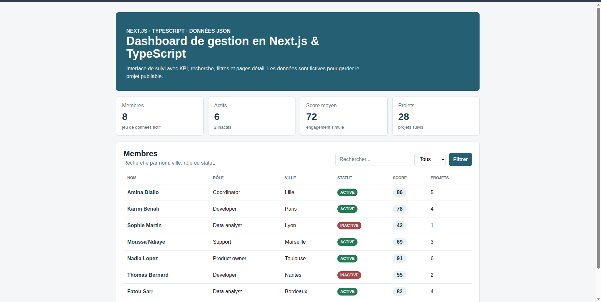
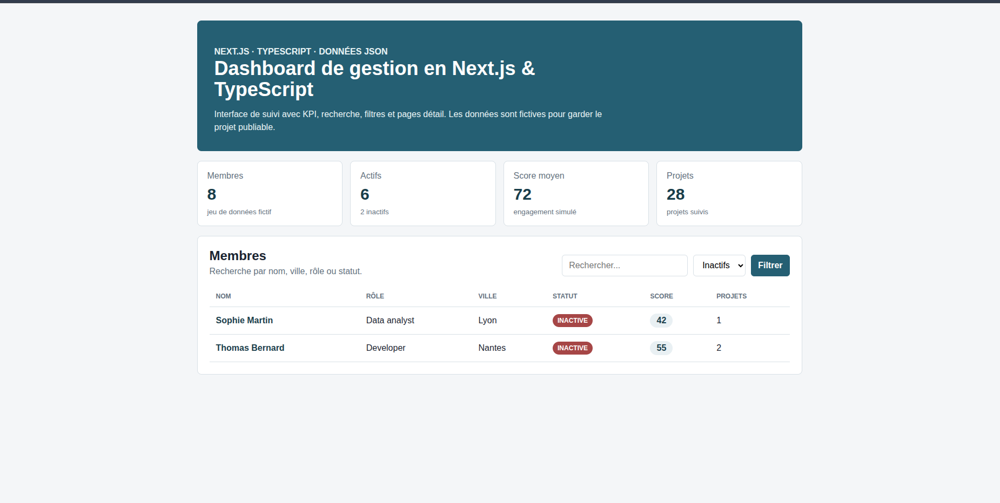
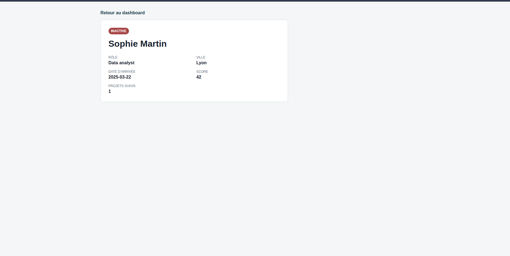
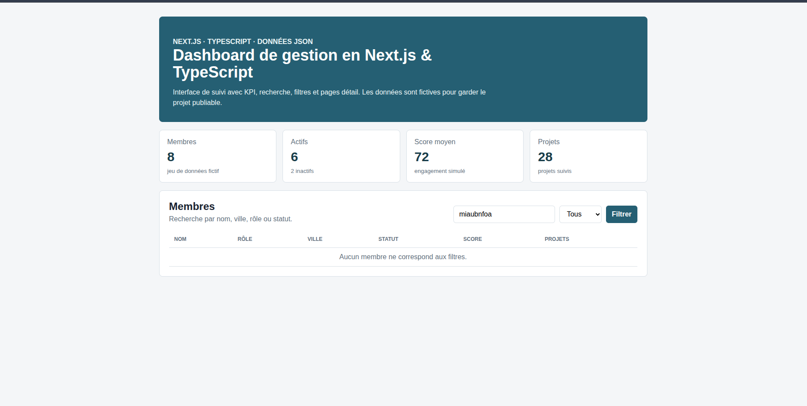

# Next.js TypeScript Dashboard

Projet vitrine full stack front-end : tableau de bord de gestion avec données fictives, KPI, filtres et pages de détail.

## Objectif

Montrer une application moderne, typée et documentée :

- interface dashboard ;
- composants réutilisables ;
- TypeScript strict ;
- données métier fictives ;
- recherche et filtres ;
- pages détail ;
- structure prête pour API ou base de données.

## Stack

- Next.js
- TypeScript
- React
- CSS natif
- Données JSON locales

## Fonctionnalités

- Vue dashboard avec KPI
- Liste de membres fictifs
- Recherche par nom, ville, rôle ou statut
- Filtres rapides
- Page détail par membre
- Cartes KPI
- Mise en page responsive
- État vide si aucun résultat ne correspond aux filtres

## Installation

```bash
npm install
npm run dev
```

Puis ouvrir :

```text
http://localhost:3000
```

Pour les captures portfolio, la version production peut être lancée sur un port dédié :

```bash
npm run build
npm run start -- -p 3060
```

URL locale utilisée pour la démo :

```text
http://127.0.0.1:3060
```

## Structure

```text
app/
  page.tsx
  members/[id]/page.tsx
components/
data/
lib/
docs/
screenshots/
```

## Données

Les données dans `data/members.json` sont fictives. Elles servent uniquement à montrer la logique d'affichage et d'analyse.

## Captures









## Captures réalisées

- `screenshots/dashboard.png` : dashboard avec KPI et table
- `screenshots/filter-active.png` : filtre sur les membres actifs
- `screenshots/member-detail.png` : détail du membre `M001`
- `screenshots/empty-state.png` : recherche sans résultat

## Améliorations prévues

- ajouter API Routes ;
- connecter Prisma + SQLite/PostgreSQL ;
- ajouter authentification ;
- ajouter Dockerfile ;
- ajouter tests unitaires.
