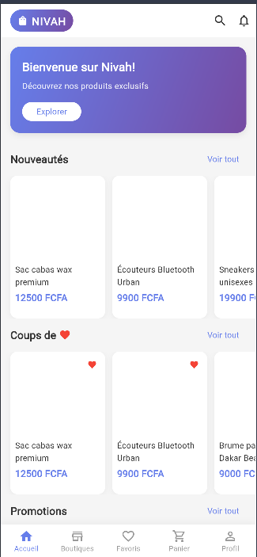
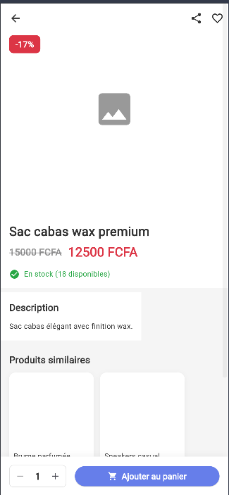
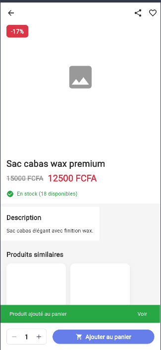
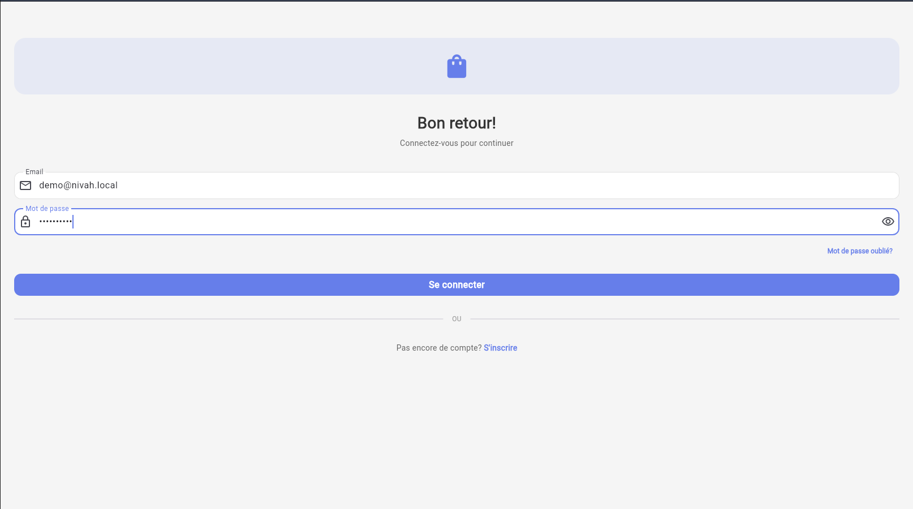

# Nivah Mobile Commerce

Application mobile e-commerce multi-boutiques avec frontend Flutter/Dart et backend PHP/MySQL local.

## Stack

- Mobile: Flutter, Dart, Provider, GoRouter, Dio
- Stockage local: sqflite, shared_preferences, flutter_secure_storage
- Backend: PHP, MySQL local, architecture MVC légère
- Fonctionnalités: authentification, boutiques, produits, panier, commandes, demandes client, paiement mobile money

## Mode local showcase

La version showcase ne dépend pas de Firebase. Les notifications Firebase/FCM ont été retirées de la configuration publique et l'application consomme une API PHP locale.

- API locale: `http://127.0.0.1:8090/api`
- Build web local: `http://127.0.0.1:58123`
- Base MySQL utilisée en local: `stc_gets`
- Seed de démonstration: `bdd/demo_local_data.sql`
- Compte démo local: `demo@nivah.local` / `Nivah@2026`

## Fonctionnalités couvertes

- Catalogue multi-boutiques avec catégories, marques, prix promotionnels et stock.
- Fiches produits avec image principale, note, boutique associée et détails métier.
- Authentification client avec token JWT côté API.
- Panier local/API avec création automatique de référence panier en environnement local.
- Base de données MySQL seedée avec boutiques, catégories, marques, fournisseur, client démo et produits.
- Configuration Flutter pilotée par `NIVAH_API_BASE_URL` pour basculer facilement vers une API locale.

## Données de démonstration

Le seed local ajoute un jeu de données compact pour les captures portfolio:

- 1 compte client: `demo@nivah.local` / `Nivah@2026`
- 3 boutiques: mode, tech et beauté
- 3 catégories, 3 marques et 1 fournisseur local
- 4 produits vitrines avec images locales servies par l'API PHP

Les visuels produits sont stockés dans `backend-api/public/demo-assets/` et reliés aux produits via la table `images_produits`.

## Captures









## Structure

```text
nivah_projet/
├─ nivah_mobile_app/   # Application Flutter
├─ backend-api/        # API PHP
├─ bdd/                # Schéma SQL et migrations
└─ docs/               # Documentation fonctionnelle
```

## Lancement mobile

```bash
cd nivah_mobile_app
flutter pub get
flutter run --dart-define=NIVAH_API_BASE_URL=http://127.0.0.1:8090/api
```

Pour générer la version web utilisée pour les captures:

```bash
flutter build web --dart-define=NIVAH_API_BASE_URL=http://127.0.0.1:8090/api
```

## Configuration backend

```bash
cd backend-api
cp .env.example .env
```

Remplir les variables locales puis exposer `backend-api/public` via un serveur PHP/Apache/Nginx.

Exemple de lancement local:

```bash
php -S 127.0.0.1:8090 -t public
```

Après import du schéma SQL, charger les données de démonstration:

```bash
mysql -h 127.0.0.1 -u stc_user -p stc_gets < ../bdd/demo_local_data.sql
```

## Notes de publication

Les fichiers d'environnement, builds Flutter, caches, dépendances PHP `vendor/`, dossiers IDE et logs sont exclus du showcase public. Les données et credentials présents dans la documentation ont été remplacés par des placeholders.
