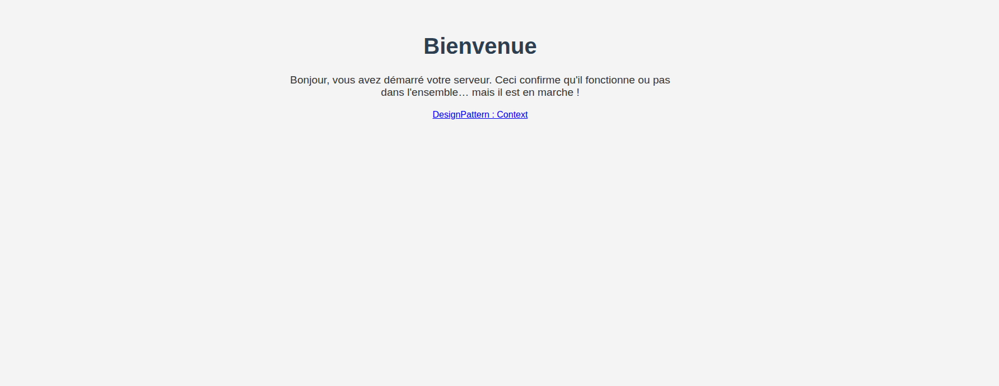
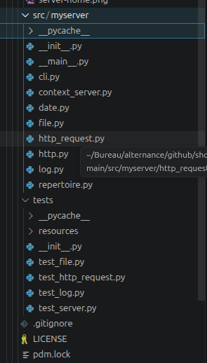
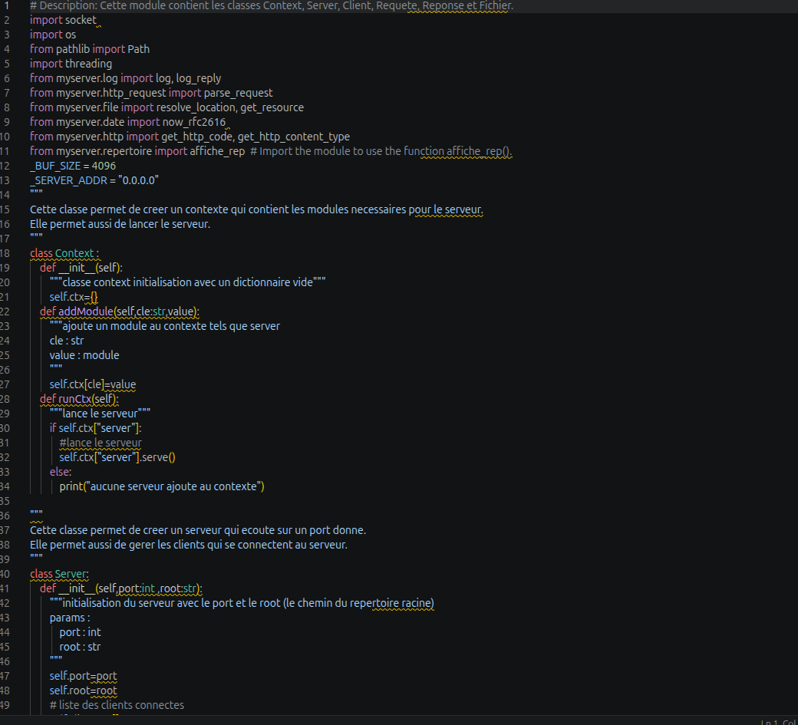
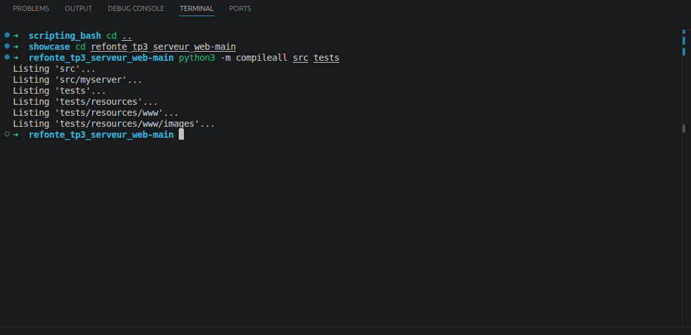

# Refonte TP3 Serveur Web

Projet vitrine Python : refonte pédagogique d'un mini serveur HTTP avec parsing de requêtes, résolution de fichiers, génération de réponses et organisation autour d'un contexte applicatif.

## Objectif

Améliorer la structure d'un TP réseau initialement écrit de manière rapide :

- séparer la CLI, le serveur, les requêtes, les fichiers et les logs ;
- appliquer une logique proche du design pattern Context ;
- servir des fichiers statiques depuis une racine configurable ;
- gérer les réponses HTTP simples ;
- documenter le lancement et les tests.

## Stack

- Python 3.9+
- Sockets TCP
- HTTP basique
- Tests Python
- PDM / pytest

## Fonctionnalités

- Démarrage d'un serveur sur un port choisi.
- Racine web configurable avec `--root`.
- Support des requêtes `GET`.
- Lecture de fichiers statiques.
- Page `index.html` si elle existe dans le dossier.
- Listing HTML simple pour les répertoires.
- Réponses `404` et `501`.
- Logs de requêtes.

## Lancement local

```bash
PYTHONPATH=src python3 -m myserver -p 6080 -r tests/resources/www
```

Puis ouvrir :

```text
http://127.0.0.1:6080/
```

Note : ce serveur pédagogique gère surtout `GET`; les requêtes `HEAD` ne sont pas l'objectif du TP.

## Validation

Vérification syntaxique sans dépendance externe :

```bash
python3 -m compileall src tests
```

Tests complets si `pytest` est installé :

```bash
python3 -m pytest
```

## Structure

```text
src/myserver/
  cli.py              # Arguments port/racine
  context_server.py   # Context, Server, Client, Request, Response, File
  http_request.py     # Parsing HTTP
  file.py             # Résolution de ressources
  http.py             # Codes et types HTTP
  log.py              # Logs
tests/
  resources/www/      # Racine web de démonstration
```

## Captures









## Captures réalisées

- `screenshots/server-home.png` : page servie sur `http://127.0.0.1:6080/`
- `screenshots/source-structure.png` : structure `src/myserver`
- `screenshots/context-server.png` : aperçu de `context_server.py`
- `screenshots/compile-check.png` : résultat `compileall`

## Ce que ce projet démontre

- compréhension des sockets et du protocole HTTP ;
- refactoring en modules Python ;
- séparation des responsabilités ;
- lecture de fichiers et génération de réponses ;
- capacité à documenter un projet pédagogique existant.
