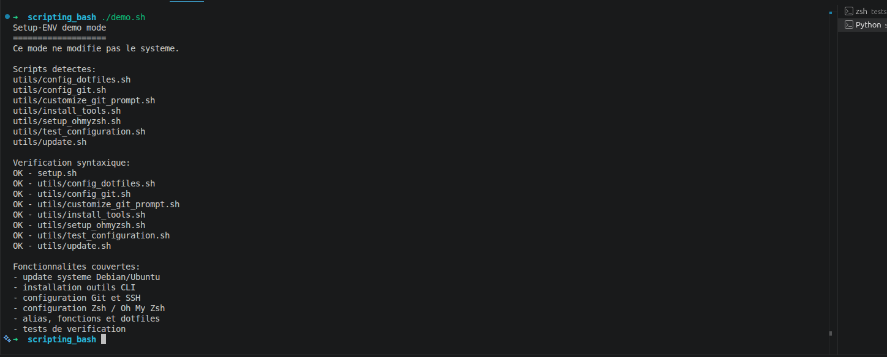
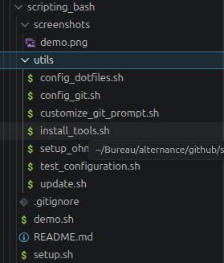
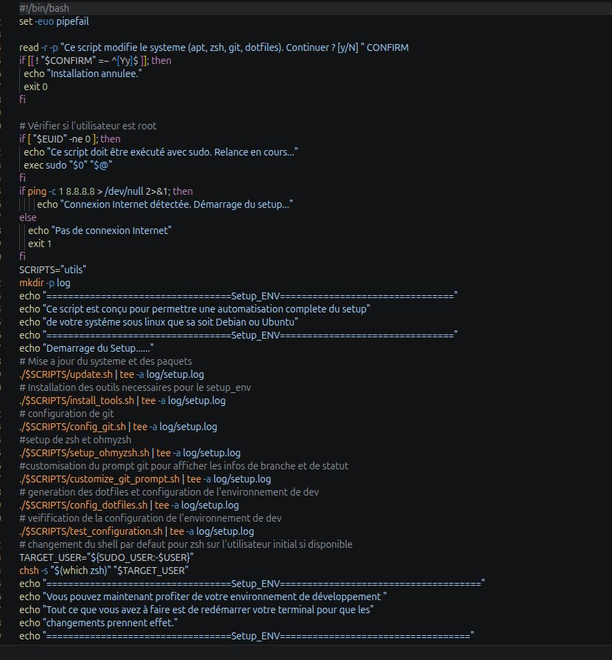
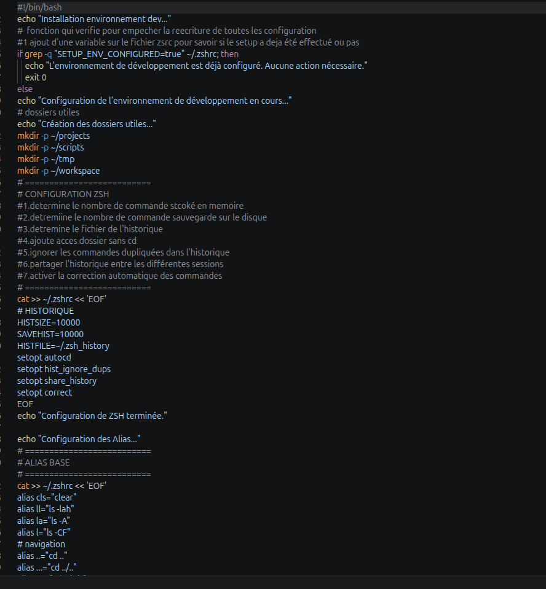

# Setup-ENV

## Description
**Setup-ENV** est un script qui configure automatiquement un environnement de développement complet sur **Debian ou Ubuntu**.  

En une seule commande, il :  
- Installe les outils essentiels  
- Configure **Git**  
- Installe **Zsh + Oh My Zsh**  
- Crée les dossiers de travail
- Ajoute des **alias et fonctions utiles**  
Temps d'installation : **3 à 5 minutes**

## Positionnement portfolio

Projet Bash/DevOps junior montrant l'automatisation d'un poste Linux: installation d'outils, configuration Git/SSH, Zsh, alias, dotfiles et vérifications.

## Sécurité d'utilisation

Le script demande une confirmation avant modification du système. Il ne versionne pas les logs locaux et demande le nom/email Git au lancement au lieu d'utiliser une identité personnelle codée en dur.

Pour une démonstration portfolio sans modification du système, utiliser le mode démo :

```bash
./demo.sh
```

Ce mode liste les scripts, lance les vérifications syntaxiques Bash et affiche les fonctionnalités couvertes.

---

## Installation rapide
Cloner le projet et lancer le script :

```bash
git clone <url-du-repo>
cd setup-env
./setup.sh
exit  # Redémarrer le terminal
```

---

## Changer le shell (Zsh)

Pour revenir à Bash si nécessaire :

```bash
chsh -s /bin/bash
```

---

## Outils installés

Le script installe automatiquement :  
`git`, `curl`, `wget`, `zip`, `unzip`, `zsh`, `micro`, `htop`, `tree`

---

## Dossiers créés automatiquement

Lors du setup, les dossiers suivants sont créés dans votre home :
- `~/projects` : pour les projets
- `~/scripts` : pour les scripts personnels
- `~/tmp` : dossier temporaire
- `~/workspace` : espace de travail

---

## Configuration Zsh appliquée

La configuration automatique inclut :

- **HISTSIZE=10000** : nombre de commandes stockées en mémoire
- **SAVEHIST=10000** : nombre de commandes sauvegardées sur disque
- **HISTFILE=~/.zsh_history** : fichier d'historique
- **setopt autocd** : accès aux dossiers sans `cd`
- **setopt hist_ignore_dups** : ignorer les doublons dans l'historique
- **setopt share_history** : partager l'historique entre sessions
- **setopt correct** : correction automatique des commandes

---

## Configuration Micro

L'éditeur **Micro** est configuré par défaut :
- `export EDITOR=micro` : éditeur par défaut
- `export VISUAL=micro` : pour les éditions visuelles
- `export PAGER=less` : pager par défaut

Fichier de configuration : `~/.config/micro/settings.json`
- Sauvegarde automatique
- Indentation 4 espaces
- Numéros de lignes
- Coloration syntaxique

---

## Alias utiles

### Navigation
- `..` : remonter d'un dossier
- `...` : remonter de deux dossiers
- `....` : remonter de trois dossiers
- `ll` : liste détaillée avec permissions (`ls -lah`)
- `la` : afficher fichiers cachés (`ls -A`)
- `l` : listing compact (`ls -CF`)

### Sécurité
- `rm` : supprimer avec confirmation (`rm -i`)
- `cp` : copier avec confirmation (`cp -i`)
- `mv` : déplacer avec confirmation (`mv -i`)

### Git
- `gs` : git status
- `ga` : git add
- `gc` : git commit -m
- `gp` : git push
- `gl` : git log avec graphique et décorateurs
- `gco` : git checkout
- `gb` : git branch
- `gd` : git diff
- `gcl` : git clone
- `gacp` : git add . && git commit -m && git push (raccourci complet)

### Gestion système
- `update` : mise à jour du système (`apt update && apt upgrade`)
- `install <pkg>` : installer un paquet
- `remove <pkg>` : supprimer un paquet
- `clean` : nettoyer les paquets inutiles
- `search <pkg>` : chercher un paquet
- `h` : afficher l'historique des commandes
- `c` / `cls` : effacer l'écran

### Informations système
- `mem` : afficher la RAM disponible (`free -h`)
- `disk` : afficher l'espace disque (`df -h`)
- `cpu` : informations du processeur (`lscpu`)
- `top` : lancer htop (plus beau que top)
- `path` : afficher le PATH

### Processus
- `psa` : lister tous les processus (`ps aux`)
- `psg <nom>` : chercher un processus spécifique
- `ports` : lister les ports ouverts (`ss -tulnp`)
- `myip` : afficher l'adresse IP publique

### Fichiers
- `duh` : afficher taille des dossiers/fichiers (`du -sh *`)
- `dfh` : afficher espace disque (`df -h`)
- `tree` : structure des dossiers (profondeur 2)
- `f <nom>` : chercher un fichier par nom (`find . -name`)

---

## Fonctions utiles

```bash
# créer et entrer dans un dossier en une ligne
mkcd <dossier>

# afficher la taille d'un dossier
size <dossier>

# chercher du texte dans tous les fichiers du dossier courant
srch "texte_a_chercher"

# afficher les informations système (CPU, RAM, Disque)
sysinfo

# lister les ports ouverts et processus associés
openports

# tuer un processus par son nom
killp <nom_processus>

# compresser un dossier en zip
zipit <dossier>

# décompresser un fichier zip
unzipit <fichier.zip>
```

---

## Structure du projet

```
setup.sh                    # Script principal orchestrateur
demo.sh                     # Mode démonstration sans modification système
utils/
 ├── update.sh             # Mise à jour système (apt update && upgrade)
 ├── install_tools.sh      # Installation outils (git, zsh, curl, wget, etc)
 ├── config_git.sh         # Configuration Git automatique (SSH ED25519)
 ├── setup_ohmyzsh.sh      # Setup Zsh + Oh My Zsh + plugins
 ├── customize_git_prompt.sh # Thème Agnoster + polices Powerline
 ├── config_dotfiles.sh    # Configuration alias + fonctions + dotfiles
 └── test_configuration.sh # Tests de vérification
README.md                  # Documentation complète
```

---

## Vérifications utiles

Vérifier les scripts sans toucher au système :

```bash
bash -n setup.sh utils/*.sh demo.sh
./demo.sh
```

Afficher tous les alias configurés :
```bash
alias
```

Vérifier la configuration Git :
```bash
git config --global user.name
git config --global user.email
```

Voir la clé SSH publique :
```bash
cat ~/.ssh/id_ed25519.pub
```

Vérifier le shell utilisé :
```bash
echo $SHELL  # Doit afficher: /usr/bin/zsh
```

Voir les logs d'installation :
```bash
cat log/setup.log
```

---

## Dépannage

### Les alias ne fonctionnent pas
```bash
source ~/.zshrc
```

### Vérifier que Zsh est le shell actif
```bash
echo $SHELL  # Doit afficher: /usr/bin/zsh
```

### Vérifier l'historique Zsh
```bash
history
```

### Repasser en Bash
```bash
chsh -s /bin/bash
```

### Consulter les logs d'installation
```bash
cat log/setup.log
```

### Vérifier que Micro est bien installé
```bash
which micro
```

---

## Prévention de réinstallation

Le script vérifie si l'environnement est déjà configuré avec la variable `SETUP_ENV_CONFIGURED=true` dans `~/.zshrc`. Si elle existe, l'installation n'est pas rejouée.

Pour réinitialiser :
```bash
grep -v "SETUP_ENV_CONFIGURED" ~/.zshrc > ~/.zshrc.tmp && mv ~/.zshrc.tmp ~/.zshrc
```

---

**Auteur** : Abdoulaye MBAYE  
**Date** : Mars 2026  
**Environnement** : Debian 11+, Ubuntu 20.04+

## Captures









## Captures réalisées

- `screenshots/demo.png` : sortie de `./demo.sh`
- `screenshots/scripts.png` : structure du projet et scripts `utils/`
- `screenshots/setup.png` : aperçu de `setup.sh`
- `screenshots/dotfiles.png` : aperçu des alias/fonctions dans `config_dotfiles.sh`
